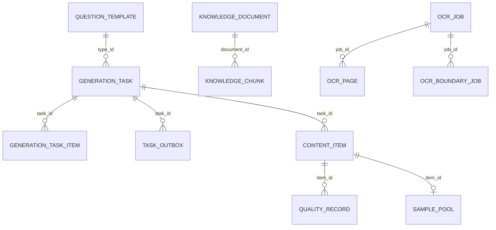
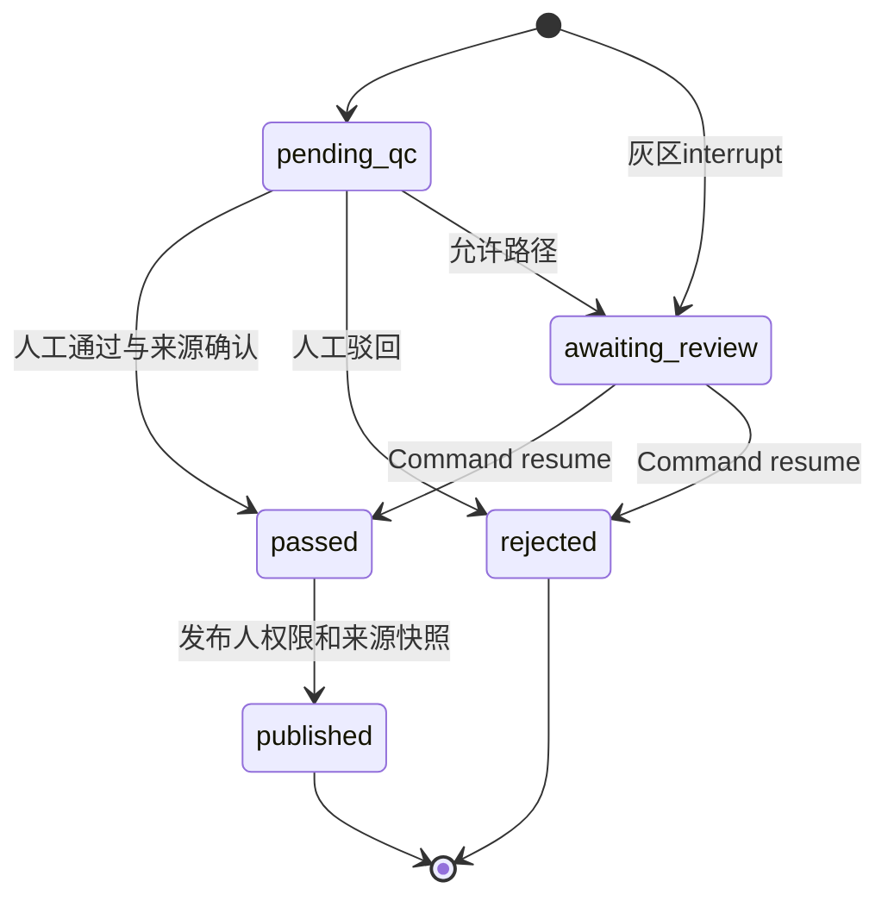

# 专题03：数据模型与状态机

> **读者**：项目维护者；详细机制以当前源码为准。
>
> **核对日期与范围**：2026-10-06（Asia/Shanghai），当前实现基线 OPT-077。本次仅同步文档，依据现役源码、Docker状态、只读SQL及已保留的阶段验收；未重跑测试、部署、迁移、模型或人工审核。全局修复状态见[主文档](英语内容生产工作台-当前实现与系统架构.md)第1.4节，验收/历史边界见[现役修复与证据补充](历史与证据/03-现役修复验收与证据补充.md)。
>
> **总入口**：[英语内容生产工作台-当前实现与系统架构](英语内容生产工作台-当前实现与系统架构.md)。


## 1. 如何读数据：业务对象不等于工作流状态

数据权威依次是活动数据库、实际迁移、[models.py](../../backend/app/models.py)与业务读写路径；历史架构文档的表数/状态注释可能已过期。当前SQLAlchemy声明22张业务表，LangGraph自己的checkpoint表及alembic_version另外管理。

一个生成请求产生task、多个task item与可能的content；Graph state也有generated/validated/qc_done/stored等节点状态。这四者不能共用一张状态表。本文解释字段/关系/一致性，跨进程恢复见[04-任务执行与可靠性](04-任务执行与可靠性.md)，质量语义见[01-内容生成与质量闭环](01-内容生成与质量闭环.md)。

## 2. 表关系与追踪ID



这是逻辑图；例如content.template_id是字符串而非所有关联都具外键。以字段定义核对物理约束，不能用ER图推断全部删除级联。

| ID | 用途 | 易混点 |
|---|---|---|
| task.id | 一次批次请求 | 不等于一题 |
| task item.id | 条目行主键 | 与thread_id不同 |
| thread_id | task_id:item_index，Graph与内容幂等标识 | 不应只用父task ID恢复某item |
| trace_id | 阶段调用/生命周期关联 | 同一thread多个调用，非一行唯一 |
| task_outbox.id | Outbox行UUID | replay脚本接收的是它 |
| event_id | task:<id>:dispatch，稳定逻辑投递键 | 不等于幂等消费或云调用exactly-once |
| document.id / index_revision | 资料身份 / 活动索引版本 | 重建document ID保留，chunk ID替换 |
| chunk.id / segment_id | 索引块 / 实际交付来源段 | 一个chunk可产生多个不同segment |
| source_hash/content_hash/input hash | 原源/规范化或块body/向量输入身份 | 不能互相替代 |

## 3. 配置与执行表

### 3.1 question_template、model_profile

`question_template`重点字段：type_id唯一、version、input_schema/output_schema、quality_rules、gen_prompt、run_config、template/prompt/skill hash、status、tenant与时间。模板输入输出是JSONB，结构和规则可动态变化，不意味着任意输出都没有Schema校验。

`model_profile`：name唯一、provider/model_name、provider_id/provider_config_hash、is_default、cost_tier、status、health_status、failure_count、cooldown_until、max_fallbacks、budget_per_task、model_hash、tenant。name全局唯一给多tenant同名档案带来约束；共享配置逻辑与完整多组织产品不能混同。

启动YAML覆盖活动模板配置；已有模型档案映射不被seed覆盖。OPT-076新增model_provider（端点、加密凭据、安全revision/hash、状态）和model_route（按题型生成/Judge覆盖）；route独立存储不被YAML启动同步抹掉。Provider密钥只写不读，专用环境key解密；同tenant默认模型含NULL用SQL局部唯一保证。版本和审计快照用于追溯，但当前DB活动值不一定还等于旧任务快照。

### 3.2 generation_task

- template_id有外键到题型type_id；params、quantity为生成入参/总数量。
- status/progress是父聚合，不是内容发布状态。
- request_hash受OPT-076局部唯一索引uq_active_generation_request保护，覆盖pending/dispatched/running/awaiting_review且非NULL；终态可重做，旧NULL兼容。查询仅为友好提示，SQL是并发裁决者，task＋Outbox同事务冲突回滚并返回获胜任务ID。新指纹采用稳定模板/route身份，不用启动易改的updated_at；OPT-076部署时无活动任务；旧hash格式在途升级仍需排空/核对，不把不同格式hash比较当完全等价。
- version_snapshot固化配置摘要；result_summary/trace_ref提供状态和回放入口。
- cancel_requested_at是合作式取消信号，不是已经终止外部请求的证据。

不要直接将pending改成succeeded而不产生item/content；也不要删除request_hash来解决页面重复请求而不理解幂等语义。

### 3.3 generation_task_item与task_outbox

| 表 | 关键字段 | 物理约束 |
|---|---|---|
| task item | task_id、item_index、thread_id、status、content_id、attempts、failure、retry_after、起止时间 | (task_id,item_index)唯一；thread_id唯一；task级删除CASCADE，content_id删除SET NULL |
| Outbox | event_id、task_id、payload、status、attempts/retry_base、lease_token/lease_until、available_at、sent_at、last_error | event_id唯一；task级删除CASCADE |

item.attempts表示执行进入worker的次数，模型JSON retries与QC采样另记Trace。Outbox发送成功仅说明broker提交，不说明下游生成或人工通过。

## 4. 内容、质量、样本与校准表

### 4.1 content_item

payload存单选stem/options/answer/explanation，或完形passage/blanks、阅读passage/questions。OPT-075新增独立可空JSONB validation_report，保存确定性错误/位置告警，不混入payload或provenance；新内容保存当时报告，内容查询按现役模板只读诊断，不批量回写旧题。provenance为当时实际来源与核验状态，qc_score为当前展示分，revise_count/cost/thread/failure/published信息提供追踪。

thread_id可空但非空值唯一，支持旧行兼容和新thread幂等。task_id是FK；template_id当前为索引字符串，不能假设删除模板就会自动处理全部内容。

source-required人工通过后qc_score可变成100，驳回可变0；原auto分保留于quality_record，不应以当前内容分重新计算自动质量历史。

### 4.2 quality_record与quality_evaluation

| 属性 | QualityRecord | QualityEvaluation |
|---|---|---|
| 定位 | 内容item_id | thread_id + revise_count |
| 用途 | 内容自动/人工评分记录 | 每轮draft质量结果，包括失败/未入库 |
| 状态 | source=auto/manual_review等 | completed/failed + is_final |
| 规则快照 | config_snapshot/template_version | snapshot/threshold/dimension_scores |
| 幂等 | 服务检查已有决策等 | (thread_id,revise_count)唯一 |

质量分母必须按事件定义；最终未落库内容不等于没有发生生成/QC费用。业务约束由服务/graph执行，不是数据库对任意JSON写入自动判断语义。

### 4.3 sample_pool与quality_calibration

sample_pool按item_id唯一保留payload、知识点、purpose/source与meta；source=auto是同步动作来源，不是模型自动证明优秀。人工通过/已发布是服务入口的资格条件，不是任何底层pool_item调用都能自动推断。

calibration保存新/默认权重和阈值、样本数、假通过数、放水度、驳回率、note、tenant。样本不足可能仍有一条“保持默认”的记录；出现记录不等于优化有效。本次只读快照这两张表均为空；few-shot消费代码和部署开关已启用，但没有实际样本注入/收益验收，微调训练仍未实现。

## 5. 知识文档、块与引用数据

### 5.1 KnowledgeDocument是活动源快照

保存source_name/type、source_hash、content_hash、parser_version、normalized_text/original_text、blocks、warnings/stats、meta以及状态。meta包含layout、index_revision、结构签名/审核决定和index_input_signature。

不是单纯“文件目录”：原OCR二进制在文件卷，数据库保存的是文本/结构/来源身份。DB dump不包含全部原PDF、页结果与缓存。

### 5.2 KnowledgeChunk

重点字段：document/parent/prev/next IDs、chunk_type/index、body/content_hash、context_header/section_path、标签ID/label、search_text、page/range、embedding、模型/维度/input hash、parser/chunker版本及meta。

- embedding可空，parent为NULL向量；leaf和parent不能只按“有content”区分。
- legacy可没有document/chunk_type等字段，迁移兼容不能假定所有行都新协议。
- parent/prev/next自FK删除SET NULL，document FK删除CASCADE；上层撤除/重建还有显式清理和状态同步。
- embedding列固定Vector(1024)；只改EMBEDDING_DIM会与Schema不一致，需模型/迁移/数据重建计划。
- source_segments的顶层row范围可空；每段同时有源snapshot偏移和leaf正文偏移。

### 5.3 JSON source segment例子

```text
{
  block_id, page_no,
  source_start, source_end,       // 规范化源字符范围
  content_start, content_end,     // 当前leaf内部字符范围
  content_hash,
  source_locator, role
}
```

这是字段说明，不是允许丢掉其他定位字段的最小写入schema。返回protocol v2的引用还包含segment_id、chunk/document/revision、实际送达文本、截断/表行/结构身份等。ContentItem保存的是送达快照，不只一串可以变更的chunk ID。

source_envelope只能导航；一个页码或bbox不能表达不连续组合段的全来源。重建后旧chunk ID失效，但旧内容中的原文本/hash可以继续解释当时生成证据。

## 6. OCR三类表与两套状态

| 表 | 关键数据 | 为什么单列 |
|---|---|---|
| ocr_job | 原文件key/hash/大小、选页、解析状态、lease、preview、approval、index状态/revision关联 | 解析完成不等于已向量化入库 |
| ocr_page | job/page唯一、status、attempts/history、cache、result key/hash、engine/latency/error | 页面级续跑/不重识别成功页 |
| ocr_boundary_job | job、2/3页范围、source_preview_hash、lease token、result/cache/error | 局部多页复核不修改原成功页 |

OCR job解析状态常见pending/running/retry/completed/failed/cancelled；index_status另有not_requested/pending/indexing/indexed/needs_attention/stale/removed等活动处理状态。保持两者独立，不能看job.completed就认为embedding完成。

OcrPage的(job_id,page_no)唯一；boundary防重复窗口还有服务层按范围/源hash查找，不能把它误说成已存在对应SQL唯一键。

审批/lease/token/hash都不是“普通metadata”，它们决定谁有权提交新索引或attempt结果。维护脚本不得只写status而遗漏token/dispatch/preview约束。

## 7. Trace、审计、用户与通知

| 表 | 关键语义 |
|---|---|
| trace_snapshot | FK到调用行的加密脱敏请求/应用响应、存储bytes/hash/replay_level/expires_at；额度/回收与访问独立控制 |
| trace_log | 每次模型尝试/生命周期；task/trace/item关联、stage/model、attempt/success、token/usage标志、价格和脱敏输入输出 |
| config_audit_event | 配置实体/操作/人/tenant/前后快照，追溯模板或模型变化 |
| users | username唯一、password_hash、role/status/tenant；明文口令不存文档 |
| app_notification | tenant/关联任务或内容、稳定event_id、标题/消息、读状态；当前无独立user recipient字段，不是外部推送队列 |

OPT-077摘要与完整载荷分离：TraceLog.snapshot_status明确available/拒存/过期/旧不可用；原1039摘要legacy_unavailable，不填伪造正文。新TraceSnapshot仅在配额事务内保存，读取须ops/scope、hash/TTL、独立key；过期删除密文不删Trace费用。主库sample0，few-shot消费仍校验实际人审/源scope/hash/现役Schema，不把purpose标签当专家证明。

Trace总行数含0成本事件；模型计数要按stage/usage/attempt过滤。DB日志与失败spool不是事务中同一行同步写入，主业务rollback也不能撤回已发生的外部费用。

## 8. 状态迁移和跨表同步

### 8.1 内容状态是服务端门禁



[status.py](../../backend/app/domain/status.py)定义content转换；[quality_service.py](../../backend/app/services/quality_service.py)与[content_service.py](../../backend/app/services/content_service.py)执行。数据库没有替任意SQL写入检查这张转换表，所以“直接改status”绕过服务会破坏门禁。

### 8.2 task/item/Graph映射

| Graph结果 | 实际worker item | 内容 |
|---|---|---|
| stored | succeeded | pending_qc |
| awaiting_review | awaiting_review | awaiting_review |
| rejected | failed | 拒绝稿/失败证据 |
| 外部异常耗尽 | failed | 可能没有内容，需查item/Trace |
| cancelled | cancelled | 不能假定没有先前模型调用 |

父任务锁行后用共享aggregate_item_statuses聚合；最终进度只计succeeded/failed/cancelled，awaiting为活动但投递保护项。已完成生成但仍等待人工的parent为awaiting_review，待人工不算最终进度；人工resume后再决定成功/部分成功/失败。普通pending_qc内容审核与Graph interrupt不同，生成task可已成功。取消parent不被迟到结果复活；前端进度为0～1乘100显示。

**状态契约（OPT-076）**：task八种、item六种现役值；旧queued/stored/rejected只保留Python别名，SQL旧值迁移归一，未知Graph结果失败关闭。SQL Check与API Literal拒绝未知状态；不将content、Graph中间态强行写成item状态。

## 9. 事务、唯一性与安全范围

| 动作 | 事务/幂等边界 | 仍有风险 |
|---|---|---|
| 创建任务 | task＋Outbox同DB事务＋活动hash SQL唯一 | 旧hash格式在途升级须先排空/核对；不保证云副作用exactly-once |
| Outbox发送 | skip-locked+CAS→发送lease提交→外发快照→同token ack | 过期sender仍可能外发，消费锁/幂等兜底；云副作用不保证exactly-once |
| 图执行 | thread advisory lock＋checkpoint＋内容唯一thread | 云调用不能与SQL形成一个ACID事务 |
| 索引重建 | 完成embedding校验后替换同ID数据 | 费用已发生、文件/Trace独立提交，不等于全系统原子 |
| 人工审核 | 内容状态/来源检查＋记录/快照 | 原source语义正确性仍靠审核人 |
| OCR | SQL token条件＋文件hash/key＋结果提交 | 文件和DB跨资源，失败需可恢复孤立产物 |

[tenancy.py](../../backend/app/tenancy.py)与retrieval predicates强制scope，NULL tenant是历史默认租户。外键仅保证ID存在，不保证关联对象同tenant或同document，跨scope关系安全还要代码检查。

## 10. 索引与迁移

[rag_p1_def.py](../../backend/alembic/versions/rag_p1_def.py)创建HNSW余弦索引（排parent/NULL向量）、FTS GIN、trigram GIN、knowledge_point_ids GIN及父子自FK。模型metadata里的普通index不能代替这些自定义迁移对象。

`create_all`只生成模型声明，不能证明Alembic历史和这些SQL索引齐备；集成fixture实际`alembic upgrade head`并核对扩展/head。当前head为opt077_trace_samples（独立快照表与snapshot_status；前一opt076为状态/并发/Provider/Route），业务表22，checkpoint表由PostgresSaver.setup独立管理。

改变向量维度、非空约束、FK或唯一键前：备份→预检→检查既有数据→迁移→测试→运行核对。不能stamp跳过历史、删除主库、或把向量列类型当纯配置修改。

## 11. 只读诊断与数据修改原则

以下SQL仅供经过授权的现有库连接执行，不包含凭据，不是本轮写库动作：

```sql
SELECT version_num FROM alembic_version;
SELECT status, count(*) FROM generation_task GROUP BY status;
SELECT status, count(*) FROM content_item GROUP BY status;
SELECT task_id, item_index, thread_id, status, failure_code
FROM generation_task_item WHERE task_id = :task_id ORDER BY item_index;
SELECT id, event_id, status, attempts, available_at
FROM task_outbox WHERE task_id = :task_id;
SELECT stage, success, count(*) FROM trace_log
WHERE task_id = :task_id GROUP BY stage, success;
```

`:task_id`为SQLAlchemy式绑定占位符，直接psql需按工具语法绑定，勿字符串拼接用户输入。恢复优先服务/API/指定补偿脚本，人工SQL更改前列出跨表和checkpoint同步影响。

本轮不修改状态、密码、索引或Schema。当前快照与备份方案见[05-部署运维与验证](05-部署运维与验证.md)；迁移后source支持与输出质量不可由数据库行数推导。

