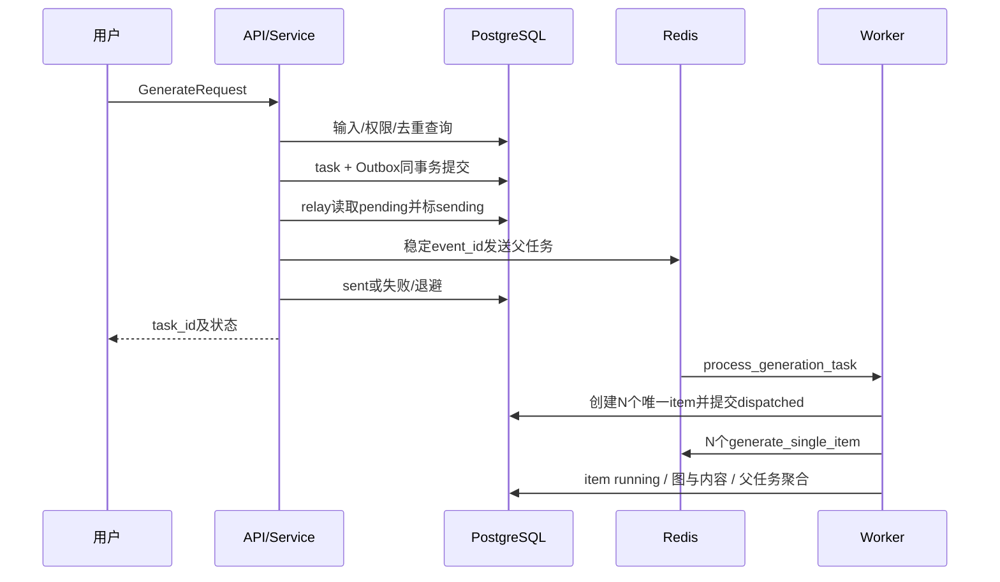

# 专题04：任务执行与可靠性

> **读者**：项目维护者；详细机制以当前源码为准。
>
> **核对日期与范围**：2026-10-06（Asia/Shanghai），当前实现基线 OPT-077。本次仅同步文档，依据现役源码、Docker状态、只读SQL及已保留的阶段验收；未重跑测试、部署、迁移、模型或人工审核。全局修复状态见[主文档](英语内容生产工作台-当前实现与系统架构.md)第1.4节，验收/历史边界见[现役修复与证据补充](历史与证据/03-现役修复验收与证据补充.md)。
>
> **总入口**：[英语内容生产工作台-当前实现与系统架构](英语内容生产工作台-当前实现与系统架构.md)。


## 1. 可靠性要保护什么

本项目需要保护五类状态：已接收的生成请求、待执行item、进行中的Graph、OCR成功页、已发生模型调用及费用。它们分别在DB、Redis、checkpoint、文件卷与Trace中，不存在一个覆盖所有资源的事务。

因此目标是“有限重试、可追溯、可补偿、尽量不重复”，不是严格云调用exactly-once。本文按真实代码边界说明；业务状态字段见[03-数据模型与状态机](03-数据模型与状态机.md)，运维执行手册见[05-部署运维与验证](05-部署运维与验证.md)。

## 2. 组件职责和队列

| 组件 | 当前职责 | 不是 |
|---|---|---|
| FastAPI | 请求/权限校验、写task/Outbox、尝试投递 | 在HTTP内完成整批生成 |
| Redis | Celery broker/results | 主业务事实或完整checkpoint库 |
| 生成worker | 默认队列celery，并发5，独立item会话 | OCR推理worker |
| OCR worker | 队列ocr，并发1，页处理/索引/局部复核 | 自动启动宿主机MinerU模型服务 |
| shared beat（沿用ocr-scheduler服务名） | OPT-074常驻，周期生成maintenance＋OCR/boundary sweep | 自动代替人工审核或零损失保证 |
| LangGraph/PostgresSaver | 按thread持久化节点状态、人工interrupt恢复 | 替Celery保存所有待消费消息 |
| DB/file spool | 任务/页/审批/Trace安全回退证据 | 队列损坏后无条件全部自动恢复 |

源码：[celery_app.py](../../backend/app/worker/celery_app.py)、[tasks.py](../../backend/app/worker/tasks.py)、[ocr_tasks.py](../../backend/app/worker/ocr_tasks.py)、[graph.py](../../backend/app/workflow/graph.py)。

OPT-075补充内容失败闭环：Graph invalid不再无界回generate，而是携带具体结构反馈进入有界revise，耗尽reject；旧checkpoint/QC缓存/待审写入也执行同一门禁。详细规则和94条新增回归见[第四点验收](../现状文档/10-6优化第四点落地与验收.md)。此改动不改变OPT-074父/子消息补偿协议。

## 3. 请求提交到独立item的时序



API成功返回task_id只证明受理/写库，不等于broker一定收到、生成成功或人工通过。请求创建后`relay_pending(limit=1)`扫描最早可发送事件，不是所有pending一次清空；旧积压与失败应有补偿责任。

## 4. Outbox投递及边界

### 4.1 数据与发送顺序

[outbox.py](../../backend/app/outbox.py)使用逻辑event_id=`task:<id>:dispatch`，DB唯一。流程：

```text
pending且到available_at
→ sending、attempts+1提交
→ 外部sender发送稳定Celery task_id
→ 成功sent / 失败pending并退避 / 次数耗尽dead
```

stale sending按lease_until/旧updated_at有界回收；PG skip-locked+CAS领取带随机lease token，提交后快照外发，只有有效token能ack。失败退避/次数有限，累计attempts保留；人工replay设置retry_base开启新有界周期并尝试仅所选事件投递。

### 4.2 周期维护、投递记录与有界恢复（OPT-074）

父事件task:<id>:dispatch，子事件item:<task:index>:dispatch；item与子Outbox同事务保存，部分broker失败不丢投递证据。shared beat默认20秒运行maintain_generation，对账后relay；worker启动也触发，单独生成环境不再依赖OCR profile。

覆盖活动pending/dispatched缺项、sent超过3600秒无执行确认、stale running超过1800秒且无执行锁；retry_after未到不抢跑。已完成、取消、awaiting_review、不属于投递失败的终态禁止自动/显式复活。发现已有thread content则修复item，不重调用生成。

父/子Outbox的skip-locked/CAS、租约fencing与全worker非阻塞item锁已真PG验证。旧token无法覆盖新ack；外发不持DB事务。稳定task_id不是broker去重，仍可能重投，消费幂等和云响应后checkpoint前费用窗口保留。

消息持续无确认达到投递预算进入dead/DELIVERY_EXHAUSTED，执行恢复耗尽RECOVERY_EXHAUSTED；父扩展耗尽补缺失败item，让progress不永远卡N项。replay_outbox按行UUID显式新周期、只投目标，不发送其他历史pending；失败保留周期重试，不保证命令返回就生成完成。

证据与完整操作见[OPT-074验收](../现状文档/10-6优化1-2-3落地与验收.md)。

## 5. 生成item幂等与图恢复

### 5.1 每item身份

(task_id,item_index)唯一、thread_id唯一；图和内容用同一task:index标识。worker发现已succeeded/awaiting_review/failed/cancelled可跳过重复执行；图有已完成checkpoint也可返回原状态。ContentItem非空thread唯一防重复落库。

这几层都需一致：只改item status不更新图，或恢复了错误thread，仍会出现状态与内容不一致。

### 5.2 锁、会话与checkpoint

- 每个Celery item创建自己的SQLAlchemy Session，finally关闭；不共享API请求会话。
- Graph生产使用PostgresSaver和psycopg3独立连接、autocommit，saver.setup管理checkpoint表。
- thread执行使用PostgreSQL session advisory lock；锁由独立连接持有，不因节点commit释放。
- memory模式只进程内锁/MemorySaver，不能跨backend和worker恢复；production/staging默认拒绝MemorySaver降级。
- checkpoint有最终state且无next时直接返回；有interrupt时保留awaiting_review；其余从保存节点续跑。

[database.py](../../backend/app/database.py)主业务使用psycopg2驱动，PostgresSaver使用psycopg3；两条连接链路和事务不应混为一个事务。

### 5.3 无法承诺exactly-once的窗口

```text
provider生成成功/已收费
→ 进程在保存Trace/节点checkpoint/内容前崩溃
→ 重投时本地看不到该成功结果
→ 可能再次生成并收费
```

锁/唯一约束能避免重复提交业务终态，但不能撤销云端请求。故必须记录失败/attempt/usage，在恢复演练中分别测消息重投和外部副作用重复。

## 6. 失败分类与四重预算

[failure_policy.py](../../backend/app/worker/failure_policy.py)沿结构化异常与__cause__/ModelRoutingError.last_error分类，防循环；不通过错误文本里“429”等数字猜HTTP状态。

| 类型 | 示例 | 结果 |
|---|---|---|
| 瞬态 | SDK连接/超时、Redis/DB OperationalError、HTTP408/429/5xx | 有限retry |
| 永久 | 非瞬态HTTP4xx、确定业务PlatformError | 保留code，失败关闭 |
| Trace无法持久化 | TracePersistenceError | 瞬态分类，可有限重试 |
| 未知 | 未归类异常 | UNKNOWN_ERROR，默认不重试 |

worker retry将item置回pending并记录retry_scheduled；尝试耗尽标RETRY_EXHAUSTED。SQL失败先rollback，再保存item失败；失败原因多为类型名/脱敏摘要，详细模型校验看Trace。

四种预算：

1. 模板max_retry：JSON/Schema输出尝试；
2. Judge每采样轮max retry：当前2轮/每轮最多3次；
3. 模板max_revise：内容低分后生成新稿；
4. Celery TASK_MAX_RETRIES：外部任务失败重跑。

叠加会增加调用，不能用“最多3次”概括整个任务。model fallback还有独立档案限制；成本预算不是供应商硬额度。

## 7. 取消、超时与父进度

### 7.1 取消是合作式

API仅允许相应活动状态取消，保存cancel_requested_at。调度前、运行item入口等检查；已经发出的模型请求不立即终止。取消时可能保留已完成内容和已发生费用。

没有执行强制worker revoke/进程杀死来实现“即时取消”。人工强杀又进入重投/副作用重复场景，应在运维演练中单独评估。

### 7.2 当前超时参数

生成全局软600秒/硬900秒、visibility_timeout3600秒，late ack/reject_on_worker_lost、prefetch1。OCR页/索引/boundary任务有按各自timeout配置的软硬限制，不全部套生成900秒。

硬超时杀进程无法执行所有finally/失败落库；需依赖未ack重投、lease、checkpoint与恢复，不是“设置了超时一定写failed”。

### 7.3 父任务聚合

[tasks.py](../../backend/app/worker/tasks.py)锁父task后使用[status.py](../../backend/app/domain/status.py)的共享聚合：progress为最终succeeded/failed/cancelled项数除预期总数，缺项不提前100%。全部生成结束但仍有人审卡点时parent为awaiting_review，继续活动防重但不投递恢复；人工恢复后再决定succeeded/partially_succeeded/failed。

全成功才为succeeded；成功＋失败/取消为部分成功，全部取消为cancelled，无成功且失败/取消混合为failed。显式cancelled不会被迟到结果复活；通知只在终态转换时发出并按原event_id幂等。未知Graph结果不能默认成功；前端0.5显示50%。普通内容pending_qc仍可能对应生成task成功，不能与Graph awaiting混同。

新提交由SQL局部唯一索引保证活动request_hash唯一，查询不是并发保护；6真PG连接只有1任务/Outbox。旧死信与同hash另一个活动任务冲突时拒重放；新hash版本在途升级须静默排空/核对。详细合同见[第二轮与模型设置验收](../现状文档/10-6优化第二轮与模型设置落地验收.md)。

## 8. Redis持久化和SQL消息对账（OPT-074已落实）

Redis已由匿名卷/RDB迁至命名deploy_redis-data，AOF yes/everysec。先停写与消费者、SAVE/RDB备份、只读复制旧dump、AOF关闭bootstrap验证4236键值，再在线启AOF等rewrite完成，最后正式AOF配置重建/新增值重启验证。原匿名卷与备份保留，不flush真实队列。

SQL bounded对账不限于旧startup running：活动pending/dispatched/running的投递/执行证据按期限检查，持item执行锁不回收活跃worker；自动预算耗尽停机为明确失败/死信，人工决定重放。main历史终态不自动重派。

AOF everysec并非零损失；断电/磁盘损坏、provider已收费但checkpoint未存等仍需备份/费用核对，不宣称strict exactly-once。原CI库＋原Redis专用UUID list丢消息演练已验证sent→loss→SQL补投→单结果/重复跳过，非清主Celery队列破坏演练。

## 9. OCR页、索引和boundary恢复

### 9.1 页处理

[ocr_runner.py](../../backend/app/worker/ocr_runner.py)每消息处理有界页工作，job lease_token/lease_until控制所有权；完成页结果用独立attempt artifact/hash，只有有效token提交。成功页保留，下一页再派；本地服务失败以页错误/有限attempt/history记录。

sweep处理过期lease、重试到期、待派发任务和索引租约；同时[boundary.py](../../backend/app/worker/boundary.py)回收局部复核。SQL持久化＋文件hash＋token fencing不是简单“Celery retry重新跑整本PDF”。

### 9.2 审批和向量化

[ocr_review.py](../../backend/app/services/ocr_review.py)免费计算plan；approve锁job、核对source/warning/paid/partial范围/expected_revision，保存审批和pending后投递。[ocr_index.py](../../backend/app/worker/ocr_index.py)先有条件claim pending→indexing，再重算plan/hash。

索引成功与同ID新revision在DB确认后状态indexed；失败needs_attention并保旧资料。旧lease/配置变化/源变化不能借一次付费确认继续写。消息重投到已经indexed状态不盲目重嵌入。

### 9.3 boundary隔离

只接原选页内连续2/3页、source_preview_hash，保存result_key/hash/token/cache；复核成功不改变OcrPage原结果、不自动重建KnowledgeDocument。

“复核已完成”只证明新建议已获得，不能当作知识索引已自动更新。结果应用应遵循人工审核/新计划，不能静默改历史资料。

## 10. Trace持久化与恢复

[trace.py](../../backend/app/engine/trace.py)先递归脱敏/截断，再sink写入；[trace_recovery.py](../../backend/app/engine/trace_recovery.py)在sink故障时写spool原子文件。要求durability且所有出口失败，不能装作模型调用未发生，应明确TracePersistenceError。

replay_spool成功emit后删除对应spool文件，失败保留；这是**有写入/删除副作用的运维动作**，不是纯查看。backlog属所配置卷，诊断计数属进程；backend健康不能证明所有worker都无未重放日志。

spool回放幂等基于Trace身份/DB逻辑，不应手改id或复制文件制造账本重复。pending_task_cost可计入尚在spool的估算，仍不是外部账单。

## 11. 恢复演练应分别验证什么

| 场景 | 成功标准 | 特别检查 |
|---|---|---|
| API写库后Redis不可用 | task/Outbox保留，补偿后能执行 | OPT-074已周期20秒维护；超过投递预算dead，需人工重放 |
| send后sent前崩溃 | 重投不重复落库 | 模型费用是否可能重复 |
| item执行中断 | 正确thread续跑 | 节点边界/attempt和checkpoint |
| 人工interrupt跨进程 | 找到断点，resume写正确记录 | 普通pending_qc不是interrupt |
| OCR页失败/取消续跑 | 成功页复用、失败页有界重试 | source/cache/engine identity |
| OCR旧token迟到 | 不提交新活动结果 | SQL fencing与文件孤立产物 |
| 重建provider/DB失败 | 旧文档/向量仍有效 | 已付费用单列 |
| Trace DB故障 | spool可回放、计数不重复 | 卷备份/失败日志保留 |
| Redis容器重建 | pending/dispatched对账有方案 | OPT-074限定消息丢失恢复已验；不覆盖所有灾难场景 |

[recovery_drill.py](../../backend/scripts/recovery_drill.py)和[backend/tests/integration](../../backend/tests/integration)提供限定故障/跨会话验证；有脚本不代表所有场景已真实破坏性演练。压力脚本会真实建任务/调用模型，先看帮助与成本范围，不因文档存在自动执行。

## 12. 当前维护优先级

1. 保持shared beat/worker/DB/命名Redis卷运行，监控死信、预算耗尽、过期租约和明确失败；已完成的状态/并发/投递机制不再列作待开发。
2. 来源required与人工审核/发布门禁保持；真provider批次按人工质量与费用逐步扩大，不能由数量协议测试直接推出大批量质量已验。
3. 新chat快照的独立key、配额和7天保留期纳入维护。共享generation maintenance每轮最多回收200过期密文，保留摘要/费用；整个DB故障仍原spool策略，spool不是完整载荷恢复证据。
4. 配置真实不同候选并积累专家金标；模型A/B工具与few-shot已存在，真实效果依赖尚未完成的数据/配置。
5. 更广故障/灾备与长期负载另限定范围/费用，OPT-074限定Redis演练不升级为全部灾难场景认证。

当前合同与既有验收集中见[现役修复与证据补充](历史与证据/03-现役修复验收与证据补充.md)；本次仅同步说明，没有执行恢复/重放/故障演练。

## 任务页交互（OPT-078）

现有取消API已接入任务页：pending/dispatched/running且具权限才显示确认入口，确认前不POST、提交后提示处理中，最终状态由后台返回；awaiting_review/终态不显示取消。活动且页面可见时5秒GET，用户可暂停；当前页过滤不是全库查询。本轮取消写请求全部mock，原8任务不变，后端恢复/Outbox协议未改变。见[OPT-078前端UIUX验收](../现状文档/10-6前端UIUX首轮优化与验收.md)。
