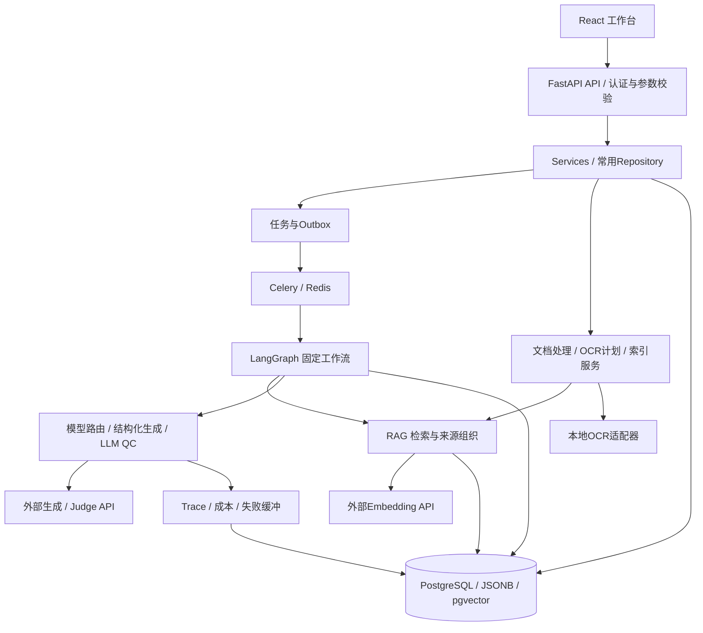
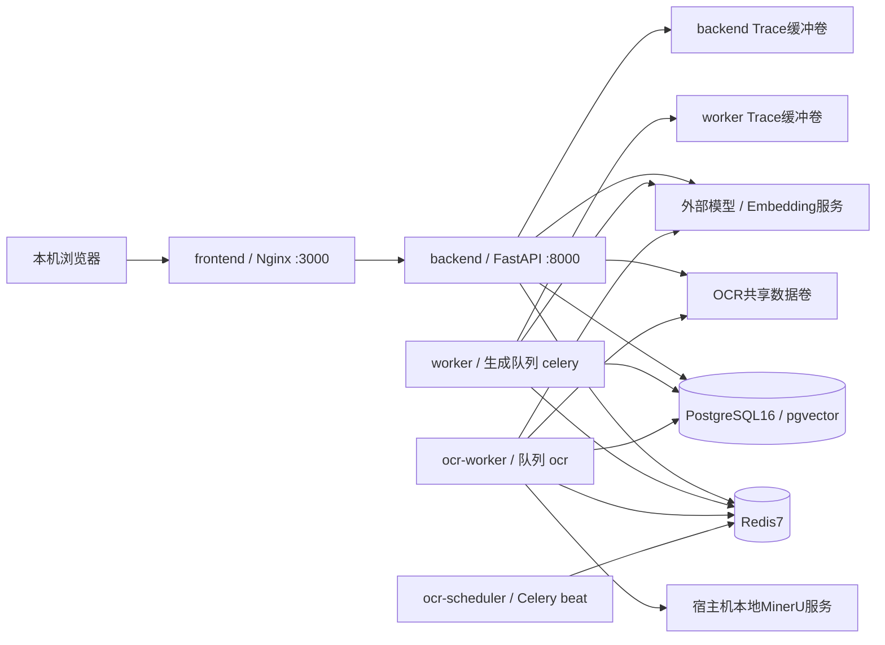
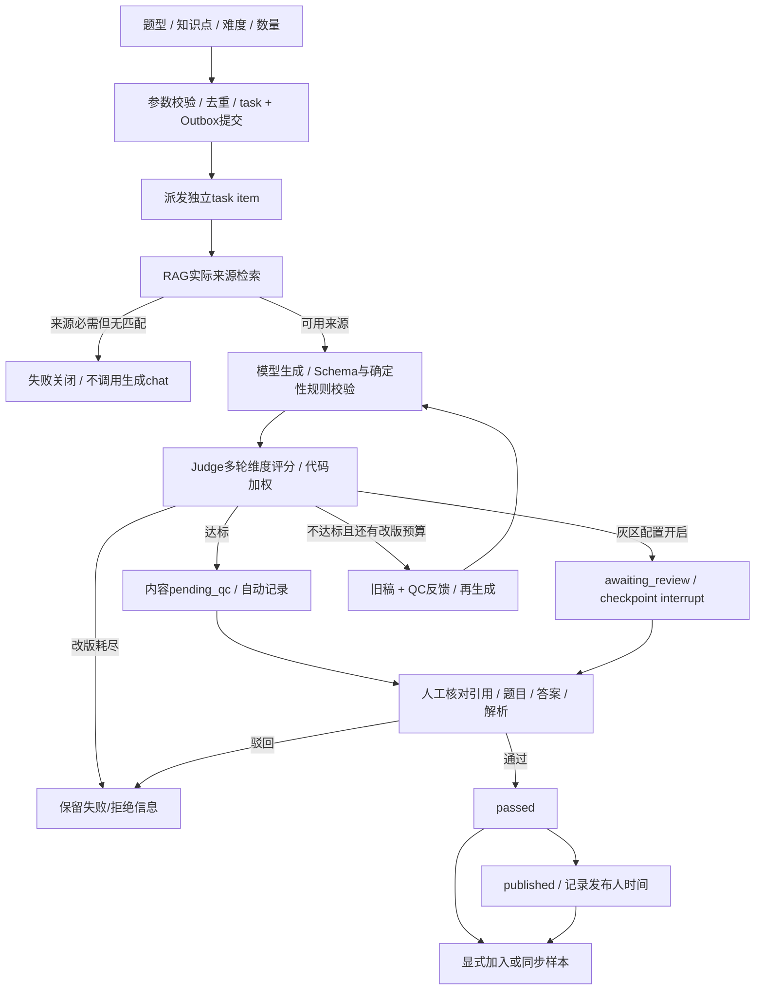
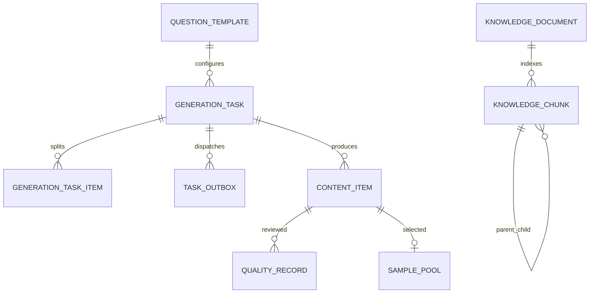
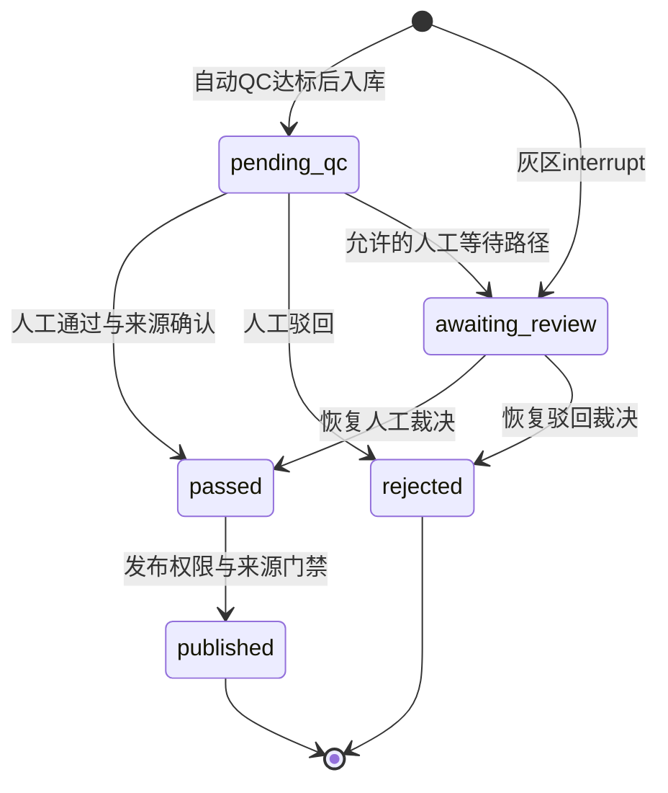

# 英语内容生产工作台：当前实现与系统架构

> **用途**：给项目维护者建立一份可独立阅读的当前实现说明，回答“系统能做什么、怎样实现、怎样使用与维护、验证到什么程度”。不是宣传稿，不是未来设计，也不是按时间堆叠的开发日志。
>
> **核对日期**：2026-10-06（Asia/Shanghai）。后端实现基线为 OPT-077；前端首轮UI/UX为 OPT-078。原文档同步仅只读，随后实际前端改动与验证见[OPT-078前端UIUX验收](../现状文档/10-6前端UIUX首轮优化与验收.md)；不混作后端新阶段。OPT-074～077的已解决项与仍待效果验证的部分见第1.4节和[现役修复与证据补充](历史与证据/03-现役修复验收与证据补充.md)。
>
> **阅读约定**：功能有代码 ≠ 当前启用 ≠ 真实效果通过 ≠ 可以无人值守生产。本文分别标明这些状态；统计数字是带日期的快照，不是长期不变的指标。仓库工程约束仍以 [AGENTS.md](../../AGENTS.md)、[CLAUDE.md](../../CLAUDE.md) 与 [.ai/rules](../../.ai/rules) 为准。

## 阅读导航

| 想解决的问题 | 优先阅读 |
|---|---|
| 快速知道项目是什么、现在能否使用 | 第1章：定位、术语与可用范围 |
| 理解各服务、进程和模块如何分工 | 第2章：系统全景架构 |
| 看懂一份资料或一道题完整经历什么 | 第3章：两条业务主线 |
| 从网页操作找到对应后端入口 | 第4章：工作台与API能力地图 |
| 维护数据、定位状态异常 | 第5章：数据模型与状态契约 |
| 理解生成、RAG、可靠性与质量实现 | 第6章：关键实现机制 |
| 启停服务、改配置、备份、处理故障 | 第7章：部署与日常维护 |
| 区分测试、真实验证和未解决风险 | 第8章：验证现状与风险 |
| 新增题型、换模型、修问题 | 第9章：维护与扩展路线 |
| 找关键源码、历史报告和后续专题 | 第10章：代码索引与文档维护 |

### 专题阅读入口（五份均已完成）

| 专题 | 深入回答什么 |
|---|---|
| [01-内容生成与质量闭环](01-内容生成与质量闭环.md) | 参数/数量、模板PromptSkill、输出校验、QC、人工与样本校准 |
| [02-文档处理与RAG](02-文档处理与RAG.md) | 文档/OCR、结构切分、源段坐标、向量与混合召回、关系返回/评测 |
| [03-数据模型与状态机](03-数据模型与状态机.md) | 22表字段/约束、ID与版本、状态映射、事务和迁移 |
| [04-任务执行与可靠性](04-任务执行与可靠性.md) | Outbox/Celery/checkpoint、失败分类、取消/恢复与消息丢失边界 |
| [05-部署运维与验证](05-部署运维与验证.md) | 配置/部署/备份、操作副作用、评测口径、排障与验收 |

### 历史与证据入口

- [历史与证据索引](历史与证据/00-历史与证据索引.md)：按阶段/问题找原报告与本机底稿。
- [阶段演进与决策记录](历史与证据/01-阶段演进与决策记录.md)：OPT001～073的演进与默认值变化。
- [验收矩阵与失败追踪](历史与证据/02-验收矩阵与失败追踪.md)：验证范围、44→43等失败、口径修正及待验收。
- 证据资产清单（本机私有证据，不随公开仓库分发）：原位路径/大小/SHA-256与可用性；不包含私有证据正文。

历史层不承担现役说明：原报告保留当时结果，private-local-only链接只供本机授权复核，不能把hash/截图当质量认证。

---

## 1. 项目定位、关键术语与当前可用范围

### 1.1 系统解决什么问题

项目把英语教研资料和大模型组合成一个带审核门禁的内容生产工作台。使用者不是只输入一句提示词并拿走结果，而是管理“资料、任务、生成稿、质量记录、人工判断和来源证据”。

- **使用者**：当前以个人开发、学习与英语教研内容生产为主；已有管理员、教研员、质检员、查看者角色。
- **输入**：PDF/Word等资料、知识点、题型、难度、数量，以及阅读题可选主题。
- **输出**：单选题、完形或阅读语篇及子题，答案/解析、自动评分、来源片段、模型调用与成本记录。
- **工作模式**：资料先审核入库；模型生成后先自动检查，再人工复核，人工通过后才允许发布。
- **工程目标**：可配置题型、可追踪调用、可恢复任务、可迭代质量，不把安全与结构合法性仅交给Prompt。

更准确的分类是**配置驱动的AI工作流系统**。LangGraph图与程序决定步骤、路由、重试和权限；不是由一个开放式Agent自主决定任意工具调用和业务流程。

### 1.2 必须区分的概念

| 术语 | 在本项目中的含义 | 不代表什么 |
|---|---|---|
| 生成任务（task） | 一次用户请求，指定题型和总数量 | 不是一道题，也不是人工审核结果 |
| 任务条目（task item） | 一个独立执行单元，拥有自己的thread/checkpoint | “执行成功”不代表内容人工通过 |
| 内容条目（content item） | 落库的题目/语篇、答案、解析及provenance | 入库不等于发布；拒绝稿也可能留存 |
| leaf / parent | leaf用于嵌入与召回；parent是较大组织单元，当前不保存向量 | parent成员被匹配不等于所有内容已返回 |
| source segment | 实际提供给生成/页面的、具有来源坐标与hash的文本段 | 候选ID或整个文档包络不是实际引用 |
| bundle（上下文包） | 多个有关系的segment组织出的一个返回结果 | Top-5不是只返回5个segment |
| 自动QC | LLM按模板维度评分，代码校验并加权 | 不是事实认证或答案唯一性证明 |
| 人工核验 | 用户查看题目及引用后作出通过/驳回决定 | 勾选行为本身不会由程序证明语义正确 |
| 发布 | 内容状态进入`published`，记录发布人/时间 | 不是自动分发到第三方平台 |
| 链路回放 | 查看保存的事件、输入/输出、来源、版本与成本 | 不保证完整原始Prompt逐字重放或确定性重新生成 |

### 1.3 当前适合怎样使用

**适合**：个人小批量出题、资料检索、来源审核、人工逐条复核后发布、观察模型质量与费用。

**不应认定已具备**：无需人工检查的大规模自动生产、全库事实正确率认证、全格式文档/OCR高准确率认证、自动专家判题、所有场景的跨页表格无损恢复。

当前内置题型为`single_choice`、`cloze`、`reading`，均version 3。三者要求知识来源，并在人工通过/发布阶段要求参考来源核验。模型生成、自动达标、人工通过、正式发布是四层不同结论。

---

### 1.4 原风险项现在处于什么状态

以下以2026-10-06当前代码和已保留的验收为准，不再把已完成工程项写成待修。阶段细节集中在[现役修复与证据补充](历史与证据/03-现役修复验收与证据补充.md)。

| 原问题 | 当前状态 | 仍需注意的边界 |
|---|---|---|
| 网页批次/单item数量混用 | **已修复，OPT-074**：外层N、每项1；多对象输出拒绝 | 一篇完形/阅读可有多个子题，不是多个Celery item；数量测试不是专家质量验收 |
| 父/子Outbox周期投递与重放不完整 | **已修复，OPT-074**：持久意图、fenced领取、周期有界对账、单目标重放 | dead需要显式处理；云调用与DB不构成strict exactly-once |
| Redis持久化/丢消息对账 | **已修复，OPT-074**：命名卷、AOF everysec、SQL补偿 | 仍非零丢失；完整灾备/长期负载未认证 |
| 高分仍有可判断的格式错误 | **确定性部分已修，OPT-075**：三题型v3与跨字段规则、有限反馈重试、通过/发布复查 | 答案语义正确与唯一仍要人工；位置偏置只告警，不强制短批次平均 |
| task/item/Graph/前端状态不一致 | **已修复，OPT-076**：集中映射、等待人工不当终态、未知Graph失败关闭、百分比正确 | 各对象仍有不同状态；不要强行改成同一组名字 |
| 请求去重存在并发窗口 | **已修复，OPT-076**：活动指纹SQL局部唯一、失败事务回滚，返回获胜任务ID | 终态可重做；旧hash格式在途升级需排空/核对 |
| Provider/模型无法真正配置 | **已补齐，OPT-076**：管理员设置页控制实际端点/密钥/档案/生成与Judge覆盖 | 本机三档仍同模型，配置能力不等于独立候选质量对比已通过 |
| Trace摘要截断、无法看到完整Prompt | **新chat受限回放已补，OPT-077**：独立加密载荷、预算/TTL/权限/审计 | 旧1039条无法补造；脱敏回放不等于原始敏感全文或确定性重跑 |
| 样本库未消费为few-shot | **消费链路已接入，OPT-077**：明确用途、实际人审/源状态/hash/scope/规则、整例预算 | 当前sample0，实际示例收益未验证；不是自动训练或专家认证 |
| 42/45集成测试计数差异 | **历史口径已澄清**；最新OPT-077为63集成＋1091非集成 | 旧阶段数字原样保留，不用新数字倒改旧验收 |

当前仍待的是**真实不同模型A/B、内容专家金标/语义裁决、few-shot真实收益、更广资料与负载/灾备验证**，不是上述工程链路仍未实现。保持人工核验与发布门禁。

---

## 2. 系统全景架构

### 2.1 逻辑分层



这里是职责图，不表示每一个API请求都会进入Celery。原生文件预览与普通入库使用同步服务路径；OCR后台任务与生成使用队列。FastAPI框架支持异步，但许多路由与数据库会话使用同步`def`/SQLAlchemy Session，不能描述成全链路非阻塞异步系统。

### 2.2 各层负责什么

| 层 | 当前职责 | 主要入口 |
|---|---|---|
| 前端 | 表单、任务状态、题目/来源查看、审核、知识资料管理、成本/链路展示 | [App.tsx](../../frontend/src/App.tsx) |
| API | 认证、权限、请求参数/文件限制、调用业务服务；部分聚合查询仍直接写在routes中 | [routes.py](../../backend/app/api/routes.py)、[ocr_routes.py](../../backend/app/api/ocr_routes.py) |
| Service / Repository | 常用CRUD、tenant范围、状态检查、事务与结果封装 | [backend/app/services](../../backend/app/services)、[backend/app/repositories](../../backend/app/repositories) |
| Worker | 拆分任务、投递/消费、失败分类、父任务进度、OCR租约与恢复 | [tasks.py](../../backend/app/worker/tasks.py)、[ocr_tasks.py](../../backend/app/worker/ocr_tasks.py) |
| Workflow | generate→validate→qc→revise/store/reject或人工中断 | [graph.py](../../backend/app/workflow/graph.py) |
| Engine | 模型档案解析/降级、JSON生成与校验、Judge、Trace/成本 | [backend/app/engine](../../backend/app/engine) |
| RAG | 解析、结构派生、切块、嵌入、混合召回、上下文恢复和引用 | [backend/app/rag](../../backend/app/rag) |
| 存储 | 业务事实、版本、状态、向量、检查点、OCR中间文件、Trace缓冲 | [models.py](../../backend/app/models.py)、[storage.py](../../backend/app/rag/ocr/storage.py) |

**分层现实**：并非所有SQL都已抽到Repository。工作流、索引器以及部分看板/成本/Trace API直接使用Session。维护时遵循现有事务边界，不把理想分层图误认为已完成全部重构。

### 2.3 部署拓扑



当前Compose启动7个项目服务：frontend、backend、worker、ocr-worker、ocr-scheduler、postgres、redis。OCR两个服务属于`ocr` profile；MinerU推理服务不在这个Compose中，走宿主机独立运行环境。CI PostgreSQL是另外的测试数据库，不是主业务服务。

- frontend为构建后的静态文件，Nginx代理`/api`，并处理单页路由fallback及后端DNS重解析。
- backend启动前执行`alembic upgrade head`；生产启动再次核对migration head，再加载模板、检查模型档案、确保种子管理员存在。
- 生成worker当前并发5；OCR worker并发1，防止大文件识别占满生成队列。
- Redis承担消息broker和Celery结果backend，不能替代PostgreSQL中的业务状态。
- LangGraph checkpoint单独持久化在同一PostgreSQL，由PostgresSaver初始化自己的表。
- Langfuse存在可选接入能力，但本机未启动该服务，实际Trace sink为`db`。

部署真源：[docker-compose.yml](../../deploy/docker-compose.yml)、[nginx.conf](../../frontend/nginx.conf)、[main.py](../../backend/app/main.py)、[celery_app.py](../../backend/app/worker/celery_app.py)。

### 2.4 本机当前快照

2026-10-06本次通过Docker状态和只读SQL核对：backend、PostgreSQL、Redis为healthy，其余现役服务为running，迁移head与源码一致。HTTP 200、PostgresSaver等专项检查属于OPT-077既有验收，本次未发API探针、未重新运行它们。

| 对象 | 当前快照 |
|---|---|
| 主业务库 | 22张SQLAlchemy业务表，另有checkpoint/Alembic辅助表 |
| migration head | `opt077_trace_samples`；三题型模板version=3 |
| PostgreSQL扩展 | pgvector `0.8.5`、pg_trgm `1.6` |
| 题型模板 / 模型档案 / 用户 | 3 / 3 / 1 |
| 任务 / 执行条目 / 内容 | 8 / 8 / 10 |
| 内容状态 | 9条`pending_qc`、1条历史`published` |
| 自动/人工QualityRecord总数 | 11；QualityEvaluation 6 |
| 样本 / 校准记录 | 0 / 0；few-shot已启用，但无可消费的真实样本 |
| Trace / 受限快照 | 1039 / 0；旧记录均legacy_unavailable，不回填旧全文 |
| 自定义Provider / ModelRoute覆盖 | 0 / 0；设置页已可用，现役三档仍ENV兼容 |
| 活动生成任务 | 0；索引uq_active_generation_request/uq_default_model_scope已存在 |
| 知识资料 / chunk | 3 / 82（81非零leaf向量 + 1 parent） |
| OCR job / page / boundary job | 4 / 12 / 2 |

这是本次只读查询时的数据库状态（2026-10-06）。它不同于OPT-073阶段“7任务”的验收快照，使用者之后又提交了请求；不以旧报告覆盖现役计数。Trace行也包含生命周期事件，不能把`trace_log`总行数直接当付费模型调用次数。

---

## 3. 两条核心业务链路

### 3.1 主线A：教研资料进入知识库

#### A1. 选择原生解析还是后台OCR

- **原生入口**：文本、Markdown、Word、HTML、CSV、XLSX及具备可提取文字的PDF。上传普通文件上限10MiB，Nginx预留multipart开销。先调用免费preview更容易发现空内容与错误切分。
- **PDF复杂版面/扫描件**：进入OCR工作台，上传或从允许目录导入。后台文件上限128MiB、任务最多500页，支持显式选页。
- **重要区别**：小窗口预览的`partial_document`不等于正式资料全量索引；OCR显式选页可以在另行确认部分范围后入库，不因此把未选页算成已解析。

解析器产出统一`ParsedDocument`：规范化text、original_text（适用时）、blocks、页/标题/表格定位、告警、hash和stats。PDF并非全部强制OCR，普通解析也不会自动理解所有图像或复杂版面。

#### A2. 结构识别与免费审核

`structure`层以可见结构与规则产生章节、逻辑单元和关系；已接受关系和proposed待审关系分开。页眉页脚、新章节、缺页、不连续选页、审核排除、独立题组等影响关系是否能成立。

OCR工作台展示原页、识别块、告警、排除开关、结构关系和切块预览。可以审核/排除/选择布局，不等同于任意编辑原始教材或在线更改一个向量值。当前公开API主要提供上传、预览、审核、重建与删除，**没有通用原文自由编辑接口**。

#### A3. 切分计划与付费确认

新资料默认structure，legacy保留为显式兼容选项。structure leaf可以跨物理页；正常表格行、题目/答案、代码与结构屏障受保护，长单元再按输入预算拆分。

OCR计划hash绑定源预览、排除块、结构决定、切分配置、embedding模型/维度、实际embedding输入hash等。先免费准备计划，用户确认来源、告警、范围和费用，再后台索引；计划失效会拒绝执行。原生上传点击索引同样会调用embedding，但它不是一套完全相同的OCR审批状态机。

#### A4. 嵌入与事务入库

索引器只给leaf做embedding，parent不保存向量。当前模型`text-embedding-v3`、1024维。完成所有批次与向量校验后，再写文档、父子块、标签、邻接、版本和输入hash。

选择性重建沿用document ID、增加index revision，替换chunk ID；失败应保留旧索引。网络费已发生但数据库写入失败时，旧索引保留不意味着已经发生的模型费用被撤销。

#### A5. 检索与后续操作

用户在知识库输入问题、选择知识点范围/来源/Top-K，查看实际bundle、segments、来源定位与候选阶段诊断。删除/排除/索引过期后，关系扩展不得从整个文档快照偷偷补回未活动的文字。

主要源码：[parser.py](../../backend/app/rag/parser.py) → [backend/app/rag/structure](../../backend/app/rag/structure) → [preview.py](../../backend/app/rag/preview.py) / [ocr_review.py](../../backend/app/services/ocr_review.py) → [indexer.py](../../backend/app/rag/indexer.py) / [ocr_index.py](../../backend/app/worker/ocr_index.py) → [retriever.py](../../backend/app/rag/retriever.py)。

### 3.2 主线B：知识驱动内容生产



#### B1. 创建任务

`GenerateRequest`的template_id和params由服务读取数据库模板并用input_schema验证。当前题型quantity范围1～50，但“允许50”不是“50条真实批次已验收”。

生成请求的总quantity用于拆item；单选一item是一题，完形/阅读一item是一篇语篇及其多个子题，不要把一篇完形10个空误计成10个独立生成item。**数量契约（OPT-074已修复）**：网页外层quantity保留批次N，params.quantity归一1；service、worker、Graph同样兜底并兼容旧task/checkpoint。多对象包装不得静默只保存第一项，走已有Schema拒绝/反馈重试。去重含batch quantity，2和5批次不因内层1误合并。真页面5/8/2请求拦截和真PG五项流程已验，不代表50项真实模型质量已验。

`task`与Outbox dispatch事件同事务写入，提交后尝试relay到Redis。请求指纹含tenant、题型、参数、批次总数与模板更新时间，只拦截活动状态相同请求；已结束请求不被此查询永久禁止。request_hash不是SQL唯一键，并发先查后写仍为另项待修。

#### B2. Worker与工作流

父任务先创建N个`GenerationTaskItem`，为每项设置`thread_id=task_id:item_index`，独立投递到生成队列。每个worker任务使用自己的会话；LangGraph按thread保留checkpoint。

生产设置为PostgresSaver，禁止默默降级到MemorySaver。图根据完整draft校验、自动分数、生效阈值、有界改版次数和人工灰区配置分支；校验失败经revise反馈重生成，耗尽reject，不再无界返回generate；checkpoint是状态恢复机制，不是模型会自动记住上下文。

#### B3. 来源必需与生成

内置模板version3均有：

```yaml
rag:
  mode: required
  require_human_verification: true
```

全局`RAG_MODE=optional`仍保留，但不能覆盖模板required；require_human_verification也使生成来源检查走required。现在生成query主要来自知识点参数，并非自动把所有复杂题目要求转成检索规划。因此细粒度知识点是否有标签/资料支持，会实际决定能否生成。

`build_rag_context`返回真实来源渲染上下文和provenance，生成引擎用独立Prompt构造业务指令与参考材料。无来源在chat前失败；来源有命中不证明模型答案正确，也不证明模型每句话都由引用支撑。

#### B4. 结构化校验、QC与改版

生成采用OpenAI兼容SDK+JSON模式，解析后由Pydantic与JSON Schema兜底，不是本地Outlines token级约束解码。当前模板`max_retry=3`，失败尝试记录Trace与费用；校验耗尽明确失败。OPT-075三种模板v3补齐四选项/字母答案等Schema和配置驱动跨字段规则，完形索引连续且空数一致，选项非空不重复、仅正文；quantity是篇数不是空数。Graph invalid有界改版→拒绝，旧QC缓存/断点、人工通过与发布也复查。至少5小题答案全部同位置只告警，不重排或强求平均。独立validation_report与只读现役诊断在前端显示；程序不证明语义正确/唯一。详细机制见[01-内容生成与质量闭环](01-内容生成与质量闭环.md)与[第四点验收](../现状文档/10-6优化第四点落地与验收.md)。

QC按模板quality_rules校验维度齐全、数值0～100、有限且无重复，当前每条2轮成功采样按维度取均值，再加权。阈值当前为70，校准存在时可覆盖权重/阈值。改版最多3轮（模板配置），复用生成路径并加入旧稿和反馈；它不等于只重试JSON。

灰区转人工需配置`human_review.enabled`，现内置模板没有开启灰区功能；来源人工核验与灰区interrupt是两套不同条件。当前自动达标的内容仍为`pending_qc`，需要后续人工通过。

#### B5. 人工复核、发布与样本

人工检查题干、选项、答案、解析、来源段后通过或驳回。代码检查reference_verified和citation存在，并保存来源核验快照；不是程序再次用一个独立专家模型证明所有事实。

只有`passed`且满足来源核验的内容才能发布。发布在本系统中改变状态并记录人/时间，没有实现外部平台推送。用户可以显式加入样本或执行同步；OPT-077已在生成前按同归属/题型/规范化知识点选择明确purpose=fewshot的合格人审整例；源状态、实际人审、hash、现役规则与来源核验重新检查，最多2例/8192额外字符。示例独立于RAG事实，当前空库不注例；导出或切为sft也不等于已经进行微调训练。

主要源码：[generation_service.py](../../backend/app/services/generation_service.py) → [outbox.py](../../backend/app/outbox.py) → [tasks.py](../../backend/app/worker/tasks.py) → [graph.py](../../backend/app/workflow/graph.py) → [router.py](../../backend/app/engine/router.py) / [structured_output.py](../../backend/app/engine/structured_output.py) / [quality.py](../../backend/app/engine/quality.py) → [quality_service.py](../../backend/app/services/quality_service.py) / [content_service.py](../../backend/app/services/content_service.py) / [sample_pool.py](../../backend/app/sample_pool.py)。

---

## 4. 前端工作台与API能力地图

前端使用React18、TypeScript、React Router、Axios；Vite构建，Nginx提供页面。OPT-078单色ERP外壳新增4组导航/原生线图标/位置与角色区、窄屏抽屉；登录/生成/任务重点优化，其余业务页沿用共享样式。权限菜单/无权页提示是UX辅助，真实权限在后端；401与跨tab状态同步，查看者默认内容库。

### 4.1 页面到功能的映射

| 页面路径 | 能做什么 | 主要API族 | 当前边界 |
|---|---|---|---|
| `/login` | 登录并保存JWT/用户资料 | `/api/auth/login`、`/api/auth/me` | 现存密码以数据库为准，seed不覆盖 |
| `/` | 按模板填写知识点/难度/数量发起生成 | `/api/templates`、`/api/generate` | 无来源required任务会失败 |
| `/tasks` | 状态/百分比/详情、当前页搜索筛选、活动自动刷新/暂停、确认取消 | `/api/tasks`、`/{id}/cancel` | 取消ack不假标终态；过滤仅当前页，任务成功不是人工通过；无关联内容直接入口 |
| `/quality` | 查看题目、实际引用，人工通过/驳回 | `/api/contents`、`/api/quality/{id}/review` | 来源未确认不能通过；校准需足够人工标注 |
| `/library` | 浏览内容、查看来源、发布符合状态的内容 | `/api/contents`、`/api/contents/{id}/publish` | 没有通用题目自由编辑/外部自动发布能力 |
| `/samples` | 沉淀/同步、筛选/预览/导出、fewshot/sft用途切换 | `/api/samples`、`/sync`、`/export`、`/{id}/purpose` | few-shot已接入人审整例，但样本表为空、真实效果未验 |
| `/knowledge` | 原生上传/预览、OCR任务、来源/关系审核、重建/撤除、检索 | `/api/knowledge`及OCR子路由 | 原生接口和OCR后台接口流程不同 |
| `/dashboard` | 任务/质量/成本聚合 | `/api/dashboard` | 需理解分母、draft QC事件与最终内容区别 |
| `/costs` | 阶段/题型/模型成本与token统计 | `/api/costs`、`/api/costs/deep` | 是配置估算，不是供应商核账 |
| `/traces` | 链路摘要、步骤详情、新chat受限快照 | `/api/traces`、`/structured-stats`、`/records/{id}/snapshot` | 摘要脱敏/截断；新chat可看受限脱敏快照，旧不能补造/不保证重跑一致 |
| `/notifications` | 未读通知、已读标记 | `/api/notifications` | 站内通知，不是短信/邮件推送 |
| `/model-settings` | 管理员自定义Provider、模型档案和生成/Judge路由 | `/api/model-settings/*`、`/api/model-profiles` | OpenAI兼容chat，凭据只写不读；留空保留ENV/YAML，不自动切模型 |
| `/users` | 管理角色、用户状态和密码 | `/api/users` | 管理员权限；当前不是复杂多组织SaaS |

### 4.2 API契约如何核对

- 以FastAPI实际注册路由为准，不以`api/`目录所有文件为准。`main.py`加载`routes.py`和`ocr_routes.py`；`routes_original/step*/backup`等历史文件不是活动API入口。
- 请求/响应边界以[schemas.py](../../backend/app/schemas.py)及具体路由中的Pydantic模型为准；knowledge/structure动态诊断还有明确的dict协议，不是所有返回都在一个schema文件中完整声明。
- 探测可用性：`/api/health/live`、`/api/health/ready`、`/api/health/dependencies`。ready检查DB/迁移/Redis/checkpointer/Trace，不检查所有云模型或OCR服务是否实际可成功推理。
- `knowledge/points`给前端提供当前布局、上下文模式、Top-K和taxonomy默认，网页应跟随API而不是各自保存一套默认。

### 4.3 权限与数据范围

| 角色 | 主要允许操作 |
|---|---|
| admin | 用户/模型配置、生成、运营、质检、发布；可跨tenant查业务数据 |
| researcher | 自己scope内生成、资料/样本管理、质检、发布和运营查询 |
| reviewer | 允许范围内查看内容和人工质检，不发起生成/发布 |
| viewer | 允许范围内读取已发布内容 |

JWT验证后仍读取数据库用户状态/角色；tenant由服务端用户身份确定，不能直接信任生成请求携带的tenant。`None`代表历史默认tenant，不是允许任意跨租户；template/model可有共享记录。部分内部调用无User具有可信跨scope能力，扩展新接口时必须确认不能让外部用户触发该绕过。

当前只有一个管理员，`tenant_id`为NULL；已有隔离基础设施和测试，不代表独立组织的SaaS开户、计费、权限产品已完整上线。

---

## 5. 数据模型、版本与状态契约

### 5.1 核心数据关系



图为逻辑关系，不声称每条关联都具有物理外键。版本、trace_id、thread_id和JSON provenance也承担追踪关系。数据库真源为[models.py](../../backend/app/models.py)，变更历史为[backend/alembic](../../backend/alembic)。

### 5.2 22张业务表按用途分类

| 分组 | 表 | 保存什么 |
|---|---|---|
| 生成配置 | `question_template`、`model_profile`、`model_provider`、`model_route` | input/output Schema、Prompt路径、QC规则、run_config、模型档案、加密Provider绑定与持久route/hash |
| 执行 | `generation_task`、`generation_task_item`、`task_outbox` | 请求、拆分项、状态、thread、失败、事务投递事件 |
| 内容/质量 | `content_item`、`quality_record`、`quality_evaluation` | 内容/provenance/独立validation_report、自动/人工记录、每一draft轮QC事件 |
| 可观测/审计 | `trace_log`、`trace_snapshot`、`config_audit_event` | 调用/生命周期、token/估算成本、配置前后快照 |
| 知识索引 | `knowledge_document`、`knowledge_chunk` | 不可变源快照、blocks、leaf/parent、标签、向量、坐标与版本 |
| OCR | `ocr_job`、`ocr_page`、`ocr_boundary_job` | 后台任务、逐页checkpoint、局部多页复核状态 |
| 回流 | `sample_pool`、`quality_calibration` | 高质量样本及其用途、根据人工标注计算的权重覆盖 |
| 用户/消息 | `users`、`app_notification` | 用户、角色、密码hash、tenant范围内站内事件 |

`QualityEvaluation`不是`QualityRecord`的重复：前者按thread/改版轮次记录draft评分与生效阈值，即使未成功入库也应追踪；后者绑定内容，区分auto与manual_review。统计自动通过率时不能仅以最终存活内容为分母。

### 5.3 为什么任务成功，内容仍是待质检

三种状态属于三个不同对象：

| 对象 | 主要活动状态 | 主要终止/等待结果 |
|---|---|---|
| task | pending、dispatched、running | succeeded、partially_succeeded、failed、cancelled；等待人工的聚合需看worker逻辑 |
| task item（实际worker） | pending、running | succeeded、failed、cancelled、awaiting_review |
| content item | pending_qc、awaiting_review | passed、rejected、published |

图节点`stored`会在worker映射为task item `succeeded`，但内容仍`pending_qc`。所以“任务成功”只说明生成执行单元到达可保存结果，不代表已经人工通过。

内容状态机：



**状态契约已修（OPT-076）**：[status.py](../../backend/app/domain/status.py)统一item六种现役值并提供Graph/content显式映射；旧queued/stored/rejected为兼容Python符号，不再写入SQL。等待人工的parent为awaiting_review，属于活动防重但投递保护；最终进度不计待人工，前端0.5显示50%。未知Graph结果失败关闭、取消parent不被迟到结果复活；SQL/API/worker/恢复/前端均已回归。

### 5.4 来源、坐标和版本怎样区分

- `KnowledgeDocument`保存normalized_text/original_text、blocks、源hash、解析器版本和当前索引revision。
- `KnowledgeChunk`保存body、context_header、embedding输入hash、向量模型/维度、parent/prev/next和chunk meta。
- structure leaf正文可能非连续；顶层content_start/end为None，meta中的source_segments记录每个原始源段以及leaf内部位置。不能再执行`document.text[start:end]`来复原整个leaf。
- `source_envelope`仅导航，明确不是连续正文跨度；页码、bbox也不能伪造为一整段统一定位。
- `index_revision`是活动索引版本，不是历史全部向量均仍在表中。重建保持document ID但替换chunk ID；旧内容provenance保留其当时文本/hash/版本，不能仅凭旧chunk ID一定查到活动行。
- template、prompt、skill、model hash和任务version_snapshot提供追溯信息；运行仍有读取现行模板路径，不能把hash快照当成一套已保存所有历史文件、可确定性复跑的执行环境。

---
## 6. 关键实现机制

OPT-076新增管理员模型设置页：Provider配置真正控制base URL/加密密钥，模型档案控制模型标识、默认降级及预算；ModelRoute为各题型生成/Judge持久覆盖，不被启动YAML同步抹掉。未绑定者仍ENV，当前Provider/route0且三档仍原同模型。每次调用记录安全provider/profile身份，不把API Key写进Trace或审计。详见[第二轮与模型设置验收](../现状文档/10-6优化第二轮与模型设置落地验收.md)。

### 6.1 模板、Prompt、Skill与模型路由

| 配置对象 | 负责什么 | 如何维护 |
|---|---|---|
| YAML模板 | input/output Schema、quality_rules、model_profile、retry/revise、RAG策略 | [backend/app/templates](../../backend/app/templates) |
| `.st` Prompt | system/user文本及参数占位 | [backend/prompts](../../backend/prompts)、[prompt_loader.py](../../backend/app/prompt_loader.py) |
| `SKILL.md`与meta | 英语命题约束、题型规范、版本化技能 | [backend/skills](../../backend/skills)、[skill_registry.py](../../backend/app/skill_registry.py) |
| 数据库模板 | 启动加载后的活动配置，API读取它 | [template_loader.py](../../backend/app/template_loader.py) |
| ModelProvider / ModelProfile / ModelRoute | 实际端点/加密凭据绑定、档案与默认降级、按题型生成/Judge持久覆盖 | [router.py](../../backend/app/engine/router.py)、[model_governance.py](../../backend/app/model_governance.py) |

API启动会把YAML模板upsert进数据库；如果只改DB模板而不改YAML，下次启动可能被覆盖。模型档案采用“缺失才seed，不覆盖已有映射”的逻辑；仅改`.env`默认模型名不保证三个已有档案会跟着变化。模板与模型的持久化策略不同，这是维护时的重要区别。

生成路由先看ModelRoute.generation_profile覆盖，留空才沿用YAML难度分档；本次route0，实际仍是单选默认lite/难题standard、完形阅读默认standard/难题high。但**lite、standard、high实际都指向`deepseek-v4-flash`**，且不同档位/独立Judge强制检查均未开启。拥有三个档案名不等于已经使用三种性能/价格不同的模型，也不能把fallback到相同模型当独立供应商容灾。

Judge解析先看持久ModelRoute.judge_profile（实际模型/Provider绑定），没有覆盖才走模板judge_model→全局JUDGE_MODEL_NAME→默认LLM_MODEL_NAME。当前全局Judge为空且模板未指定Judge，故评分也是同模型；2轮评分降低部分采样抖动，不消除同模型自偏好。

生成重试对JSON/Schema错误进行反馈；模型路由处理档案可用性、有限降级、失败计数/冷却和成本预算。`MODEL_BUDGET_PER_TASK=0`表示目前未启用全局预算上限。预算机制的估算价不是供应商硬限额。

### 6.2 结构合法性、题目质量与事实正确性分层

当前强制措施：

1. 输入参数经模板JSON Schema检查；
2. 输出JSON解析、原始结构JSON Schema、Pydantic映射、完整Schema与配置驱动题目确定性校验，失败有限重试；
3. QC动态Schema要求维度完整、数值有效；
4. 有效权重/阈值由代码检查、计算；
5. 来源必需、权限、人工核验和发布状态在服务端拦截。

仍依赖Prompt/人工判断的内容：英语答案语义是否唯一、选项是否同质、难度是否匹配、解释是否充分、来源是否真实正确、生成是否过度复述资料。不能只因输出合法、Judge分数高就认为这些都成立。

当前QC事件保存生效阈值、规则/模型版本、原生成约束和RAG provenance；Judge Prompt接收声明的约束与payload，**不会把整个教材上下文提供给Judge进行来源事实核对**。因此“已经RAG+Judge”不等于已经独立做source-grounded事实审校。

校准服务通过同时有auto/manual标注的样本比较“自动高分但人工驳回”与人工通过集合，计算维度放水度和新权重；有最低样本/假阳性数量门槛（当前代码20标注、5假通过）。这是统计权重调整，不是模型训练、RLHF或自动修复每道题；现库校准记录为0。

### 6.3 文档理解与结构感知切分

解析与OCR不是同一层：

- DOCX保持段落/表格顺序；Markdown/HTML规范化标题/表格；CSV/XLSX以sheet/列/行组织，保存合并范围并告警。
- XLSX保留公式字符串，未计算公式值；合并空位不自动推断。
- 普通PDF路径抽取文本并保存页定位，不能承诺多栏、表格、图片全部正确。
- MinerU适配器接本地推理结果，桥接块类型、标题、表格网格/跨度、bbox等；本地模型运行环境与API/worker依赖分离。
- OCR逐页checkpoint支持续跑；跨页复杂边界可做2/3页局部复核，结果为独立boundary snapshot，不自动覆盖原成功页或活动索引。

结构层依据源证据建立章节/逻辑单元/关系，而不是用LLM自由重写整本书。accepted与proposed区别、页面连续性、新章/缺页/排除屏障都影响合并。续表不能仅凭同列数就合；cell续接需要来源映射及确认，未知部分保持不确定。

structure切块规则：

- 物理页为软边界，已确认自然续文可形成跨页leaf；
- 新章、缺页、排除、独立题组/答案、表格/代码等受保护；
- 表格正常行整体保留，必要时复制表头作为派生上下文；极长行/单元可能仍按预算切，输出warning；
- 页眉页脚及纯导航标题仍在源中，但不全作为embedding正文；覆盖率分母明确为eligible正文，不是源的每个字符都被嵌入；
- source_segments校验真实文本、源/leaf范围、hash、重叠归属与预算；不能用“语义类似”代替坐标证据。

结构可靠性来自解析器、规则与人工审核的组合。默认structure不意味着所有资料都具有正确OCR、章节或续表关系。

### 6.4 混合召回、融合与small-to-big上下文

```text
原query + 有界别名/互补子问题
    ↓
同tenant / 知识点 / document / source / section范围
    ↓
向量候选（pgvector余弦） + 关键词候选（English FTS + 中文bigram/literal）
    ↓
稳定chunk ID去重 + RRF融合
    ↓
可选rerank（当前关闭） + 多问题seed分配
    ↓
仅活动leaf的结构关系扩展、去重和预算裁剪
    ↓
最多Top-K个bundle + 实际source segments + diagnostics
```

当前每查询lane最多30候选，RRF-K=60，默认最终最多5包。向量通道以SQL余弦距离排序、按minimum similarity过滤；PG有HNSW/FTS/trigram索引。某个执行计划用了ANN，不等于已经证明全部规模下的真实召回率和时延。

关键词通道不是完整中文分词器或BM25：保留英文FTS，并使用有界中文二字片段与literal匹配补召回。RRF按各lane排名计算`Σ 1/(60+rank)`，不直接按余弦数值排序；单通道rank1可能在融合后落到rank4。

当前查询扩展为taxonomy aliases，规划为rules；复合问题有有界互补query并保留原query。它们能增加embedding输入，不增加知识授权范围。知识点范围支持exact/ancestor/descendant/related/semantic，默认exact；“semantic”表示不按该知识点标签限制检索，不是取消tenant/document权限。

relation模式与“整篇parent一次读回”不同：从seed对应的活动源段出发，沿接受的关系恢复关联正文/表格/引用章节，按source坐标去重，记录不完整原因。结构过期/被排除/被删除时失败关闭或保留精确seed，不读全源补未索引文字。

**预算含义**：

| 参数 | 当前值 | 含义 |
|---|---:|---|
| `RAG_TOP_K` | 5 | 返回包上限，不是leaf候选池 |
| 网页可选Top-K | 8 | 更大证据覆盖，不保证一定8包 |
| `RAG_CONTEXT_MAX_CHARS` | 32768 | 总渲染上下文字符预算，含部分包装 |
| `RAG_CONTEXT_TOKEN_LIMIT` | None | 可选保护；现实现用UTF-8字节保守计量，非tokenizer实测tokens |
| bundle members / hops / total segments | 24 / 32 / 128 | 防无界扩展与循环 |
| chunk size / overlap | 512 / 80 | 字符与拆分参数；保护结构可能使实际块/overlap不同 |
| parent size | 2048 | parent组织预算，不是模型上下文窗口 |

这些参数不是模型支持窗口。调大预算可能增加噪声与生成Prompt成本；要检查实际上下文，而不是仅看候选数或模型最大窗口。

### 6.5 RAG当前模式与实验模式

| 方法 | 当前状态 | 不应混淆 |
|---|---|---|
| structure切分 + relation上下文 | 默认主链路，已真实入库和检索 | 不是对所有教材事实认证 |
| legacy布局 / context | 显式兼容与回退代码保留 | 改context不等于恢复旧leaf向量 |
| rerank | 适配代码有，当前off | 无真实供应商效果证明 |
| LLM查询规划/扩展 | 选配，当前未启用 | rules/aliases不是每次调用chat |
| 语义切分 | 独立CLI，真实小样本无已测增益 | 不接主链路自动切分 |
| deterministic contextual prefix | 独立真实小实验 | 源正文与派生说明不能混为事实 |
| LLM contextual | 严格抽取接口/mock测试，真实效果待验 | 源中出现的字面片段也不代表专家事实正确 |
| Late Chunking | 显式local-only token模型适配/pooling代码，未真实forward验收 | 云最终向量平均不是Late；禁止默默下载权重 |

独立实验入口[rag_experiment.py](../../backend/scripts/rag_experiment.py)默认dry-run，真实embedding需`--run --paid-embedding`，LLM-context另有显式开关。试验输出报告/Trace，不应修改活动知识索引。

### 6.6 任务可靠性、重试、取消与恢复

**四类重试要区分**：

| 类别 | 原因 | 当前处理 |
|---|---|---|
| 输出重试 | 非法JSON、字段/Schema/确定性规则错误 | 生成引擎反馈错误并有限重试，计失败费用 |
| 改版 | 合法稿质量不达标 | 图加入旧稿/QC反馈，受max_revise约束 |
| 任务重试 | DB/Redis或可分类HTTP瞬态错误 | Celery有限重试/退避；永久错误失败关闭 |
| OCR恢复 | 单页失败、租约过期、取消续跑 | 独立OCR队列、checkpoint/cache、周期sweep |

Celery配置late ack、worker lost重投、prefetch=1和消息可见性超时；主要生成任务软/硬超时600/900秒。thread锁和Postgres advisory lock、item/内容thread唯一性、checkpoint共同限制重复执行。**不承诺跨云调用与数据库的严格exactly-once**：模型响应后还未来得及保存就崩溃，仍可能产生重复费用。

取消是合作式：记录cancel_requested，调度/运行边界检查；不是立即中止已经发到外部模型的请求，已发生费用不会因为取消消失。

OPT-074将父/子投递各自持久化为Outbox；Postgres skip-locked+条件CAS领取带lease token/期限，外发不持DB事务，旧ack不能覆盖新租约。共享beat（服务名ocr-scheduler，不再依赖ocr profile）每20秒触发maintenance；worker启动也触发同一路径。对账包括pending/dispatched缺项、过期sent未确认、stale running；持有item执行锁时不抢跑，retry_after未到不重派，终态/待人工/取消保护。投递和执行恢复预算有上限，耗尽进入明确失败/死信，不无限重投。replay脚本显式授权新周期并仅投所选事件，累计attempts保留；完成/审核/非投递失败目标不得复活。

Redis实际已迁入命名deploy_redis-data、AOF yes/everysec；原4236值核对一致、旧匿名卷/RDB保留，新写重启仍在。AOF不是零丢失，云调用副作用也非exactly-once，SQL对账/备份和人工死信仍必要。当前验收详见[1—2—3落地报告](../现状文档/10-6优化1-2-3落地与验收.md)。

### 6.7 Trace、成本、版本与“回放”的实际边界

Trace记录模型调用和生命周期事件；调用包含attempt、success、模型、token用量、耗时、配置价格、输入输出与关联ID。失败调用也计入成本。secret/password/token键与字符串模式脱敏，字符串默认2000字符截断。OPT-077另存有界加密完整脱敏messages/应用响应，ops＋scope审计读取；新快照1MiB/总密文128MiB/7天，不给Langfuse传全文；旧1039无全文不能倒推。

因此Trace不是完整长Prompt档案。排查长来源还需结合ContentItem provenance、QC snapshot、checkpoint与规范化原文；模型重新生成也不保证相同结果。对精确可重放的要求，应额外定义Prompt归档策略，不能仅凭“有trace_id”宣称已完全做到。

实际sink为数据库；持久化失败可落独立spool卷并用[replay_trace_spool.py](../../backend/scripts/replay_trace_spool.py)回放。若没有任何持久化出口且要求durability，则调用失败关闭；backend Trace健康是进程内诊断，不自动代表所有worker均健康。

成本按MODEL_PRICES分输入/输出价格，缺失则fallback到全局每千token单价。reported usage、缺失usage、估算价、真正供应商账单应分开；不明币种不能写人民币/美元实际花费。[reconcile_costs.py](../../backend/scripts/reconcile_costs.py)提供内容成本与账本重算，不会自动得到供应商外部账单。

---

## 7. 当前配置、部署和日常维护

### 7.1 配置来源与生效顺序

1. 代码默认/类型校验位于[config.py](../../backend/app/config.py)；
2. Compose读取启动进程环境与所选.env；本机辅助部署复用现有容器配置并加载deploy/.env，只有显式透传字段进入进程；
3. 容器进程Settings读取环境，不会因为宿主机`.env`编辑而即时刷新；
4. 模板run_config与ModelProfile决定业务默认，独立ModelRoute可优先覆盖生成/Judge；
5. 前端读取catalog部分默认，其他是请求显式参数。

修改环境后需要重建或重建容器使配置生效；修改源码要确保镜像重新build。backend、generation worker、OCR worker必须同源，否则网页预览计划与worker计算不一致会导致hash拒绝。不要只改`.env.example`并认为运行态已更新。

### 7.2 当前关键运行值

| 类别 | 实际值（2026-10-06核对） |
|---|---|
| 环境标识 | `production`；仍是本机个人环境，不等于安全上线认证 |
| Checkpoint | postgres，ALLOW_MEMORY_CHECKPOINTER=false |
| 生成默认模型 | deepseek-v4-flash；三个档案相同模型 |
| Judge | JUDGE_MODEL_NAME空，解析到生成默认模型；2轮，最多3次无效重试 |
| 模板输出/改版/QC | max_retry3，max_revise3，threshold70，required来源与人工核验 |
| RAG | structure / relation / hybrid / Top5 / 32768字符 |
| 查询 | aliases扩展、rules规划、exact范围；rerank off |
| Embedding | text-embedding-v3 /1024维；改变维度不是一个无迁移的开关 |
| OCR | mineru后台、500页任务；RAG_OCR_MAX_PAGES=3是同步/预览限制，不是后台整任务3页 |
| Trace摘要 | db，持久化要求开启，spool独立卷；外部sink不传完整载荷 |
| 受限chat快照 | 已启用；独立加密key；1MiB/总密文128MiB/7天，ops+scope审计读取 |
| few-shot消费 | 已启用；最多2整例/8192额外字符；主库sample0，不伪造示例 |

绝不在说明文档写API Key、JWT secret、数据库密码或用户明文密码。本地账号口令曾由用户改动；当前实际用户密码以DB hash为准，seed配置只用于创建，不覆盖已存在管理员。

### 7.3 服务入口

- [前端工作台](http://localhost:3000/)；[任务](http://localhost:3000/tasks)；[质检](http://localhost:3000/quality)；[知识库](http://localhost:3000/knowledge)。
- [API文档](http://localhost:8000/docs)与[readiness](http://localhost:8000/api/health/ready)。API文档可读不代表业务API免认证。
- frontend/backend端口当前绑定127.0.0.1；DB/Redis不对宿主机公开主业务端口。
- MinerU通常经宿主机16580服务使用，实际端点/鉴权由私有配置确定；它不会随Compose OCRworker启动而自动启动模型进程。

局域网/公网使用前应重新审查账户口令、TLS、CORS、绑定地址、文件导入根和OCR鉴权，不能沿用为方便本机演示设置的弱密码。

### 7.4 启动、查看状态与健康检查

以下是维护命令，不是本轮已执行的变更；工作目录为`<仓库根目录>`。

```powershell
# 只读看服务状态
Set-Location <仓库根目录>
docker compose --env-file .env `
  -f deploy\docker-compose.yml --profile ocr ps

# 确认配置/备份后再构建启动；会更新容器和加载模板，不是只读命令
docker compose --env-file .env `
  -f deploy\docker-compose.yml --profile ocr `
  up -d --build backend worker ocr-worker ocr-scheduler frontend

# 只读探针；生产API鉴权信息不要打印进日志
Invoke-RestMethod http://localhost:8000/api/health/ready

# 看单个服务日志，注意不要把带资料文本的日志公开分享
docker compose --env-file .env `
  -f deploy\docker-compose.yml logs --tail 100 worker
```

本地OCR启动脚本为[start-local-ocr.ps1](../../deploy/start-local-ocr.ps1)，依赖已准备的本地环境/权重。不要把启动脚本理解为会自动下载或安装所有OCR依赖。health healthy只证明相应探针范围，真实推理可用仍需测试请求。

### 7.5 需要备份什么

| 内容 | 为什么不能只备份数据库 |
|---|---|
| PostgreSQL | 内容/来源文档/向量/用户/配置、checkpoint和迁移历史 |
| `knowledge-ocr-data`卷 | 原始PDF、逐页结果、预览、缓存、原页图像相关文件/后台beat状态 |
| backend/worker Trace spool卷 | DB故障时尚未重放的Trace证据 |
| 私有配置 | 模型端点、凭据、JWT配置与导入根；须安全保存，不入Git |
| 模板/Prompt/Skill与当前工作区 | 大量修改尚未提交，仅备份Git HEAD不能还原当前功能 |
| 私有验收证据 | 金标、报告、dump与截图；包含教材和登录态，不公开 |

[backup_restore.ps1](../../backend/scripts/backup_restore.ps1)给出DB备份/显式目标恢复方式；文件卷另备。恢复命令必须核对目标数据库/目录，不运行`down -v`或清空数据来“修复”。优先恢复到明确的目标库验证，然后再决定是否切换。

### 7.6 改资料、删块和重建索引

- 上传新资料先免费预览，确认可索引正文、页范围、告警和来源映射。
- 已索引资料改变排除、结构或embedding输入后，用新的计划hash和expected_index_revision显式重建；不是直接编辑向量行。
- 删块可能改变资料完整性/审核签名；按source安全规则退化，不可继续宣传原完整覆盖。
- 撤除资料会处理活动leaf/parent；OCR资料可保留供重新审核，不等于删掉所有原文件。
- 重建保持document ID，但chunk ID变化；金标最好绑定源block/page而非只有旧chunk ID。
- 切换context_mode只改变返回组织，不改变已有leaf向量；真正布局回滚要重新审核/embedding/原子替换。

### 7.7 常见故障的排查顺序

| 现象 | 先查什么 | 不要先做什么 |
|---|---|---|
| 登录失败 | 数据库用户名/active状态/实际密码；seed不会覆盖旧密码 | 不把env口令当必然生效，不直接重建用户表 |
| 网页不通 | frontend容器、Nginx代理、backend readiness | 不先清DB/Redis卷 |
| task一直pending | Outbox状态、Redis、生成worker、队列名、首次relay | 不盲目重复提交同参数任务 |
| task失败且无生成内容 | item failure_code、required来源、永久/瞬态分类 | 不关闭required来伪装成功 |
| 模型输出不合法 | generate各attempt、Schema、Prompt、JSON反馈 | 不跳过Pydantic/JSON Schema |
| 高分内容明显有问题 | 原auto维度/阈值、题干/选项/解析/来源；保存人工驳回 | 不降低人工门槛或只改gold |
| 检索没带齐 | scope/query、vector/keyword lane、fusion rank、实际segments与预算 | 不只看page命中就宣布召回成功 |
| OCR卡住 | 本地服务鉴权、页状态/lease/缓存、OCR队列和sweep | 不重OCR所有已成功页 |
| 重建计划失效 | 预览/结构/配置/模型hash、索引revision、worker同源 | 不绕过expected revision或hash检查 |
| 成本不一致 | reported usage、失败尝试、QC轮数、Trace sink/spool、估算价 | 不把content.cost当全供应商账单 |

---


## 8. 验证现状、已知限制与生产判断

### 8.1 本轮核对与历史验收分开

最新工程验收为OPT-077：1154 passed（1091非集成＋63真PG），app8974/10677=84.0498%，门槛80%保持；26＋4新增、3生产源码scoped strict、前端与实页通过。该结果取自既有日志，不是本次文档同步重跑。OPT-073～076各阶段数字、警告和范围集中见[现役修复与证据补充](历史与证据/03-现役修复验收与证据补充.md)，不能用新门禁覆盖历史。

| 证据 | 实际结论 | 不能推出 |
|---|---|---|
| OPT-073本机完整gate日志 | 911 passed、app82.34%、18条warnings | 远端CI全绿、全app严格类型无债 |
| OPT-077完整gate | **63条integration /1091非集成，共1154；app84.05%** | 真PG配额/权限/注入与实页，0真实provider；非专家质量/实际独立模型对比或全app strict |
| 运行态核对 | 本次只读：head opt077_trace_samples、模板v3、Docker正常；OPT-077曾验readiness/前端200、持久断点 | 本次重新执行了API/故障/推理验证 |
| 44条冻结来源回归 | OPT-073迁移后Top5/8均44/44 context_complete | 完整新四类金标、答案正确率100% |
| 真实6内容+负例 | 6成功待审；无来源反例chat0；一JSON失败重试生效 | 6内容全人工通过、可无人值守生产 |
| scoped static/type与前端构建 | 指定文件检查通过、前端可构建 | 全库strict、所有浏览器流程均验收 |

**历史计数更正**：OPT-073旧摘要沿用42条PG集成，初稿文档审计按marker核对为45/866共911；这是旧阶段遗漏更正。现役最新既有门禁为OPT-077的63/1091共1154，本次不重跑collect/pytest，不用新数字改旧结果。

历史测试日志与coverage：`.local-eval/str58/full-app-gate.log`、`app-coverage.json`。详细阶段报告见[RAG-主链路切换与真实生成验收.md](../现状文档/RAG-主链路切换与真实生成验收.md)。code-only测试可能使用mock模型；真实PG集成也不会自动证明真实供应商效果。

### 8.2 RAG验证到什么程度

当前知识库不是整个教材目录：

| 资料 | 实际范围 | 活动版本/布局 | leaf / parent |
|---|---|---|---:|
| 第二章 并列句 | 完整8页 | v3 / structure | 54 /1 |
| 第二章 名词 | 仅原PDF页2、16，block:15排除 | v2 / structure | 23 /0 |
| 第一章 动词 | 仅原PDF页1 | v2 / structure | 4 /0 |

原44条为有限来源相关性回归，包含原阶段的回归/旧独立样本；不是重新获得的专家盲测，不满足四类各至少10条新教材真实正反例目标。

Top3原“or表示否则的例句”曾因正确leaf vector1/keyword13/RRF4掉出实际返回；OPT-072按用户要求扩大Top5/8补回。后来名词/动词迁移也改变向量候选，不能把前后所有变化归因于一个同向量排序改善。来源齐备不代表false expansion、precision、table/cell事实质量全达标。

### 8.3 真实生成批次的结论

OPT-073依次运行：一个无来源single_choice反例，然后名词单选2、并列句完形2、名词阅读2。

- 6条正向内容都进入pending_qc，QC分87.70～91.75；1次reading首轮JSON解析失败后重试成功。
- 使用真实generate/Judge；当前Judge每条2轮，共7 generate traces（含失败）、12 qc traces。
- 开发复核发现一份完形正确项集中A、若干连词空有潜在多解；没有把它们标成专家已通过。
- UI检查6条真实内容的来源segment唯一、页/block显示、选项标签、通过勾选状态；未核验通过与pending发布请求被后端409拒绝。
- 没有提交人工通过或发布，本机那1条published为更早历史内容，不属于这6条。

阶段总账本为99 embedding +7 generate +12 qc=118模型调用记录；47938 prompt/37200 completion tokens，配置估算0.170276，币种与实付未核验。这些数字是OPT-073的历史窗口，不是当前累计成本，也不能说全部success，因为有1次JSON失败尝试。

### 8.4 当前风险清单

| 优先级 | 风险 | 维护行动 |
|---|---|---|
| 已修/持续验证 | 批次/单项数量（OPT-074） | 全链归一1、多对象拒绝；继续扩大真实模型批次质量验证 |
| 已修结构/语义仍高 | 自动高分仍可出现语义错误/潜在多解 | OPT-075拦截确定性错题、告警位置；反例已回归，人工裁决/专家金标仍待 |
| 高 | 个人环境弱口令、资料/Trace/登录态敏感 | 仅本机使用，公网前安全整改，不把私有证据提交 |
| 已修/有界保证 | Redis持久化与消息恢复（OPT-074） | 命名卷+AOF everysec+SQL对账；仍非零丢失或云exactly-once |
| 已修/有界保证 | Outbox父/子补偿（OPT-074） | 周期20秒、fencing、显式重放与预算；死信需人工，beat必须运行 |
| 已修 | 状态映射与并发请求防重（OPT-076） | 共享映射、SQL状态/活动hash约束；待人工不当终态，未知Graph不当成功，6PG连接只1task/Outbox |
| 配置能力已补/效果待 | 同模型三个档位与Judge自偏好 | 模型设置可选真实不同Provider/模型/Judge；本轮不自动更换，仍需同金标A/B |
| 中 | 规则识别/OCR与table/cell事实未全面验证 | 扩新教材专家金标，保持unknown和人工排除 |
| 工程已补/边界保留 | 受限完整chat快照（OPT-077） | 独立key/1MiB/总128MiB/7天/ops与scope访问；摘要保留，旧1039不可补造，不保证确定性重跑 |
| 中 | 依赖版本大量非精确锁定、后端全app strict未达认证 | 重建前记录版本，修类型/依赖债，不降低门槛 |
| 中 | 大批量/高并发/长上下文性能与费用无长期数据 | 分阶段压力、异常恢复与人工驳回率评估 |
| 消费已补/效果待 | few-shot人审示例（OPT-077） | purpose明确、源当前通过/实际人审/哈希/规则/整体预算；当前sample0，未证质量收益或训练模型 |

`ENVIRONMENT=production`只是启动校验分支；它不能把本机学习环境、弱账户或上述风险自动变成已认证生产部署。

### 8.5 当前使用建议

**采用“先小批量、人工逐条核对、通过后发布”的生产方式。** 不必等Late等实验完成才能使用主RAG，但不能因工程gate通过就移除人工核验。

数量口径已统一；仍先2～5项小批量，程序归一每项1，按题型和费用扩大，不将数量协议测试当专家质量通过。完形/阅读必须检查每个子题和完整语篇；记录人工驳回理由供规则与校准使用。对源错误或不确定表格应先排除/复核，而不是让生成模型帮忙“猜对”。

---

## 9. 如何维护、扩展与推进下一阶段

### 9.1 新增题型

1. 增加YAML：type_id、input/output Schema、quality_rules、gen_prompt、run_config；
2. 增加system/user `.st`；
3. 增加SKILL.md及skill.meta，核对注册映射；
4. 确定是否required来源、人工来源核验、灰区策略；
5. 验证模板/路由引用、Schema失败重试、QC权重与状态分支；
6. 加载模板并检查前端生成表单与预览。

核心生成可以配置驱动新增题型，但前端漂亮预览目前按single_choice/cloze/reading等分支渲染，新payload格式可能需要前端适配或fallback查看；“新增题型不改核心代码”不等于任意UI都自动认识新格式。

### 9.2 更换模型或Judge

先区分“环境默认模型”与“DB模型档案”；检查API/业务配置中活动档案。新模型必须验证OpenAI兼容字段、JSON输出、Schema通过、超时/重试、token usage与价目表。变更后对同金标/模板版本做比较，并记录失败尝试与总费用。

Judge独立不是把档案改名；需要真实不同模型/供应商以及一致的评分Schema。生产路由主→默认档案可提供有限降级，但如果两者指向相同模型，收益不能按跨模型容灾宣称。

### 9.3 优化检索或改变切块

- 先固定source相关性gold、scope、query、返回预算和语料指纹；
- 拆解失效位置：源解析→embedding输入→vector/keyword→融合→返回预算→结构扩展/引用；
- 切块/模型改变需重建；只改诊断或引用导航不应全库重嵌入；
- 保留失败，不改gold来凑100%；语料变动与纯context A/B分开报告；
- 查看false join、表格同行、required terms、实际source segments，不仅pageHit；
- 真正发布默认前核对backend/worker/前端preview配置与版本一致。

### 9.4 质量改进优先级

当前优先事项不是继续堆更多RAG名称，而是：

1. 数量契约/持久投递/Redis三项已在OPT-074修复；接下来人工处理已生成6条样本，明确通过、驳回与原因；
2. OPT-075已保留真实故障结构复现/合成语义反例、位置告警与确定性门禁；现6题格式4通过/2完形拒绝，不代表专家裁决；
3. 人工逐空审查语义歧义/正确性，把争议与驳回记录到既有金标工具，不能用格式通过代替专家判断；
4. 每题型扩至20～30条真实且有人工标注样本，统计source一致性/答案唯一性/人工驳回率；
5. 足够标注后再评估权重校准与独立Judge；
6. 并行的后续选项：专家table/cell集、负载恢复、Late/LLM-context真实实验；不阻塞现有人工生产。

主文档/专题初稿为只读；OPT-074～077后来已实际修复、测试与部署，原真实样本未被本轮自动通过/发布。常规Docker构建受镜像源403阻碍，OPT-075复用本地旧依赖层增量部署并核对码hash；全新依赖安装构建未认证。

### 9.5 开发与测试入口

后端命令必须在`backend`执行，避免根目录运行导致app导入失败。纯单测与PG集成分开：

```powershell
Set-Location backend

# 纯单测，不会自动启用PG集成
.\.venv\Scripts\python.exe -m pytest -m "not integration" -o addopts="-q"

# 只收集集成测试；最新既有OPT-077 gate执行63条，collect本身不等于执行
.\.venv\Scripts\python.exe -m pytest --collect-only -m integration -q -o addopts=""

# 完整gate：须预先在当前进程设置指向已确认测试库的TEST_DATABASE_URL，勿贴凭据
.\.venv\Scripts\python.exe -m pytest -q -o addopts="" `
  --cov=app --cov-fail-under=80 --cov-report=term-missing

# 前端安装遵循lock，已有依赖时直接构建
Set-Location frontend
npm run build
```

真实PG fixture通过实际Alembic迁移和独立测试事务验证，不靠`create_all`伪装迁移，也不以零向量当ANN证明。一般自动化测试mock模型；[rag_eval.py](../../backend/scripts/rag_eval.py)、[rag_experiment.py](../../backend/scripts/rag_experiment.py)及真实生成是单独的费控动作。

CI目前配置lint、纯单测、前端依赖audit/build和全量PG覆盖率80% gate，**没有单独mypy job**。仓库规范要求严格类型，已做scoped检查不代表全app通过。不要为了绿灯缩小覆盖率分母、跳过失败测试或降低门槛。

### 9.6 变更与知识同步

代码改动按[change_tracking.md](../../.ai/rules/change_tracking.md)追加OPT记录、更新tasks和回归测试；本文这次纯文档工作不占新OPT编号。

变更影响“默认能力/来源策略/运行方式/接口/数据状态”时，应同步本文对应章节，不再在每篇现状文件开头复制一段最新优化过程。具体验收证据保留在阶段报告；短摘要和链接进入主文档。日期、计数、范围与不能证明的结论必须同行说明。

---

## 10. 关键源码、证据入口与文档维护规划

### 10.1 从问题到代码

| 排查/修改主题 | 首先看 |
|---|---|
| 服务为什么不能启动 | [main.py](../../backend/app/main.py)、[config.py](../../backend/app/config.py)、[health.py](../../backend/app/health.py) |
| 生成请求校验/去重/派发 | [generation_service.py](../../backend/app/services/generation_service.py)、[dedup.py](../../backend/app/dedup.py)、[outbox.py](../../backend/app/outbox.py) |
| 任务拆分、取消、父任务进度 | [tasks.py](../../backend/app/worker/tasks.py)、[celery_app.py](../../backend/app/worker/celery_app.py)、[recovery.py](../../backend/app/worker/recovery.py) |
| 图分支、QC阈值、改版、人工interrupt | [graph.py](../../backend/app/workflow/graph.py) |
| 模型档案、JSON输出/重试 | [router.py](../../backend/app/engine/router.py)、[structured_output.py](../../backend/app/engine/structured_output.py)、[model_governance.py](../../backend/app/model_governance.py) |
| Prompt/Skill加载与来源注入 | [prompt_loader.py](../../backend/app/prompt_loader.py)、[skill_registry.py](../../backend/app/skill_registry.py)、[backend/app/templates](../../backend/app/templates) |
| Judge评分与校准 | [quality.py](../../backend/app/engine/quality.py)、[calibration.py](../../backend/app/calibration.py) |
| 人工通过/发布/来源核验 | [quality_service.py](../../backend/app/services/quality_service.py)、[content_service.py](../../backend/app/services/content_service.py)、[provenance.py](../../backend/app/rag/provenance.py) |
| 文档解析/免费预览 | [parser.py](../../backend/app/rag/parser.py)、[preview.py](../../backend/app/rag/preview.py)、[knowledge_service.py](../../backend/app/services/knowledge_service.py) |
| OCR任务/页cache/局部复核 | [ocr_service.py](../../backend/app/services/ocr_service.py)、[ocr_runner.py](../../backend/app/worker/ocr_runner.py)、[boundary_service.py](../../backend/app/services/boundary_service.py)、[boundary.py](../../backend/app/worker/boundary.py) |
| OCR付费审批/原子重建 | [ocr_review.py](../../backend/app/services/ocr_review.py)、[ocr_index.py](../../backend/app/worker/ocr_index.py) |
| 结构、source_segments与父子块 | [backend/app/rag/structure](../../backend/app/rag/structure)、[structural.py](../../backend/app/rag/chunking/structural.py)、[parents.py](../../backend/app/rag/chunking/parents.py)、[indexer.py](../../backend/app/rag/indexer.py) |
| 检索scope/候选/fusion/context | [retriever.py](../../backend/app/rag/retriever.py)、[backend/app/rag/retrieval](../../backend/app/rag/retrieval)、[knowledge_points.yml](../../backend/app/rag/knowledge_points.yml) |
| Trace摘要/受限载荷/scope/TTL/费用 | [trace_snapshots.py](../../backend/app/engine/trace_snapshots.py)、[trace.py](../../backend/app/engine/trace.py)、[trace_recovery.py](../../backend/app/engine/trace_recovery.py)、[reconcile_costs.py](../../backend/scripts/reconcile_costs.py) |
| few-shot如何选择/排除/注入 | [fewshot.py](../../backend/app/engine/fewshot.py)、[sample_pool.py](../../backend/app/sample_pool.py)、[graph.py](../../backend/app/workflow/graph.py)、[fewshot-instruction.st](../../backend/prompts/fewshot-instruction.st) |
| 表/字段/迁移 | [models.py](../../backend/app/models.py)、[schemas.py](../../backend/app/schemas.py)、[backend/alembic](../../backend/alembic) |
| 前端页面/路由/代理 | [App.tsx](../../frontend/src/App.tsx)、[frontend/src/pages](../../frontend/src/pages)、[nginx.conf](../../frontend/nginx.conf) |

### 10.2 历史设计与验收怎样使用

历史材料的完整导航、决策演进和证据清单已在[历史与证据层](历史与证据/00-历史与证据索引.md)整理。下表保留最常用阶段入口，不能据旧文件的“当前”措辞推断今天的运行配置。

| 文档 | 用途 | 注意事项 |
|---|---|---|
| [RAG-主链路切换与真实生成验收.md](../现状文档/RAG-主链路切换与真实生成验收.md) | OPT-073默认切换、两份迁移和真实生成证据 | 历史集成计数42已由本文标明收集更正为45 |
| [RAG-Top5-Top8与上下文预算验收.md](../现状文档/RAG-Top5-Top8与上下文预算验收.md) | Top5/8与32K预算对照 | 当时默认layout legacy，不是当前默认 |
| [RAG-STR5-STR6落地与验收.md](../现状文档/RAG-STR5-STR6落地与验收.md) | STR5切分/源段与STR6实验 | 当时44→43为旧预算结果，不能套到当前 |
| [RAG-STR3-STR4落地与验收.md](../现状文档/RAG-STR3-STR4落地与验收.md) | 续表/cell审核、局部多页复核、多证据组织 | fixture与真实教材效果分开 |
| [RAG-STR1-STR2落地与验收.md](../现状文档/RAG-STR1-STR2落地与验收.md) | 文档结构与关系返回协议 | 当时以不重嵌入的context比较为主 |
| [AI内容生成平台2.0-PRD.md](../AI内容生成平台2.0-PRD.md) / [AI内容生成平台2.0-技术架构设计.md](../AI内容生成平台2.0-技术架构设计.md) | 原需求/设计思路与决策背景 | 不是当前代码或运行态的唯一说明 |
| [OPT-074～077现役修复与证据补充](历史与证据/03-现役修复验收与证据补充.md) | 已修工程项/最新门禁/只读快照与清单补充 | 不重跑、不伪造旧全文或真实专家结果 |
| [优化记录.md](../优化记录.md) / [tasks.md](../tasks.md) | 历史改动与未来进度 | 不能替代本篇当前实现说明 |

私有证据在忽略目录`.local-eval`，维护者本机可复核；外部clone不一定有它，不能用缺失私有证据宣称所有结果可一键公开复现。初稿只读证据在`.local-eval/docs-current-20261006`；本次同步核对在`.local-eval/docs-sync-20261006`，不包含凭据和教材正文，不入公共文档。

### 10.3 文档架构与本轮范围

本目录采用“主文档 + 5专题 + 历史证据”的组织方式：

| 文档 | 职责 | 状态 |
|---|---|---|
| **本文** | 可独立阅读的全局认识、流程、运行/质量边界、维护导航 | 本轮完成 |
| [历史与证据层](历史与证据/00-历史与证据索引.md) | 演进/决策/验收矩阵/失败追踪及原位证据hash清单 | 已完成；原底稿未复制/移动 |
| [01-内容生成与质量闭环](01-内容生成与质量闭环.md) | 模板/Prompt/Skill、评分、改版、人工、样本/校准详解 | 已完成 |
| [02-文档处理与RAG](02-文档处理与RAG.md) | 各格式/OCR、结构/切块、检索/引用、索引运营详解 | 已完成 |
| [03-数据模型与状态机](03-数据模型与状态机.md) | 字段/索引、实体关系、状态、事务/版本一致性 | 已完成 |
| [04-任务执行与可靠性](04-任务执行与可靠性.md) | Outbox/Celery/LangGraph、并发、重试、取消、恢复演练 | 已完成 |
| [05-部署运维与验证](05-部署运维与验证.md) | 配置/服务/备份、评测方法、负载/成本、风险门槛 | 已完成 |

主文档和五份专题已创建，历史层的索引/演进/验收矩阵/资产清单也已补齐。主文档给全局摘要，专题展开机制，历史层导航当时证据；原报告和受限底稿原位保留。本轮不删除旧现状目录、不重写全部历史报告、不改业务代码。已解决工程项按第1.4节标记；未知或未验收的效果明确标为待验证，不将文档同步等同新的业务修复或效果认证。

### 10.4 文档的更新规则

- **机制变化**：更新相应章节/专题及源码入口，明确与旧版本的区别。
- **运行变化**：更新第2/7章带日期的快照；已有数据库密码/模型档案不要推断为env即时同步。
- **效果结论变化**：更新第8章，链接阶段报告，原失败和限制保留。
- **数量变化**：不是每次task/content增加都写优化日志；定期以带日期快照更新，不混用历史验收窗口。
- **未来规划**：进入第9章和tasks，不放在“已实现能力”中。
- **跨文档重复**：主文档给必要摘要，专题维护详细机制，历史报告保留证据；只设一个主要解释位置。

### 10.5 文档同步范围与后续界面变更

| 事实面 | 本次结论 |
|---|---|
| 代码 | verified-current：只读核对现役入口与OPT-074～077实现，未修改业务代码 |
| 运行态 | verified-current：Docker状态、只读SQL和白名单配置核对；历史专项测试仍按原窗口引用 |
| 主文档/五专题 | changed-and-verified：正文纠正旧版本/表数/状态/待办，已完成项与待效果验证分开 |
| 历史与证据 | changed-and-verified：阶段说明保留历史口径，新增74～77集中补充及清单；原341资产/73OPT快照不重写 |
| 规则/外部记忆 | out-of-scope：规则仅用于校核，未修改规则或写外部记忆 |
| 工作区 | 原代码改动与私有证据保留；未commit、重启/部署、清库、清场或收费调用 |

**底线结论**：项目已经具备以新版RAG支撑的、小批量且必须人工核验的内容生产流程。理解并维护它的关键，不是把技术名称记全，而是弄清每一层的输入输出、状态/事务边界和验证口径：哪些错误由代码拒绝、哪些由模型建议、哪些最终仍要人工判断。


## 前端首轮UI/UX补充（OPT-078）

[OPT-078前端UIUX验收](../现状文档/10-6前端UIUX首轮优化与验收.md)：schema字段保持wire name/N-1协议，中文label/inline校验/任务摘要；活动且可见时5秒GET可暂停，任务取消必须确认、请求后等待真实终态。任务Modal键盘/焦点/背景滚动、390px12路局部表格滚动、role/401反馈已验。14实页组/0pageerror、tsc/Vite通过，后端1091通过/63 PG跳过，本轮不重跑OPT-077真实PG或覆盖率。只前端重建/部署，原task/content/Trace/正文状态分数hash不变，没有真实生成/取消/模型调用。原补充资产清单仍为前一文档同步时快照，后来合法编辑不重算原hash。
